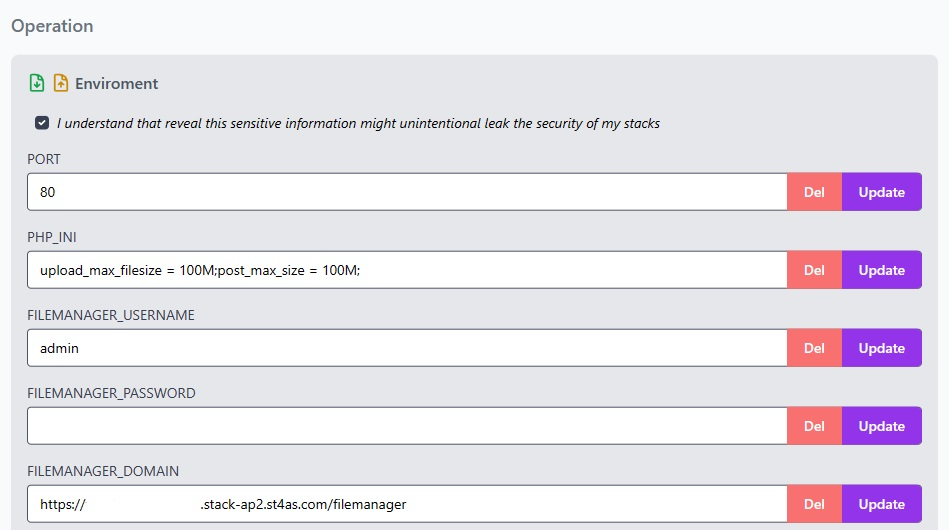
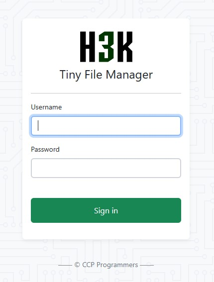
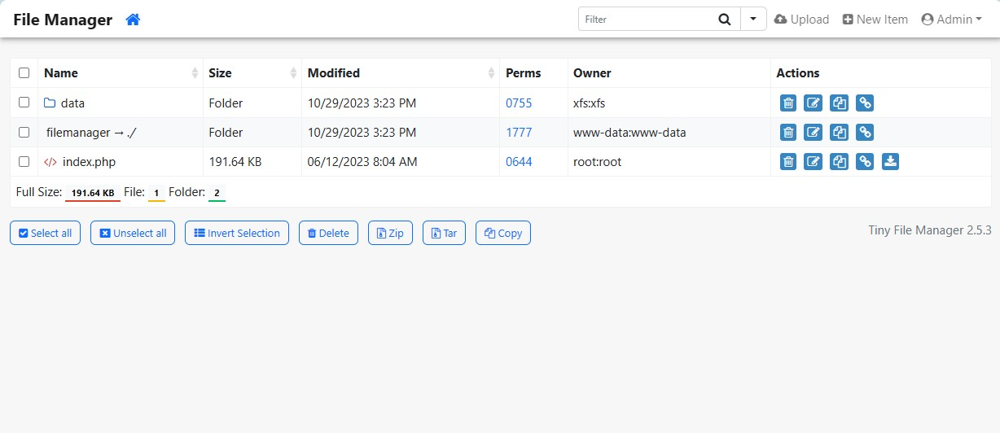

# File Manager: Streamlining File Management for Every Stack

In the dynamic world of web development, efficient file management is paramount.
Tailored to specific stacks, this feature simplifies the complex task of handling files, ensuring users have a seamless experience, regardless of their chosen technology.

In this article, we delve into Staas.io's File Manager and how it simplifies file management across various stacks.

Staas.io's File Manager is only available for a certain number of stacks, mostly the application stacks.
Staas.io seamlessly integrates File Manager into the stack of your choice.
This adaptability ensures that users can manage their files efficiently, irrespective of the platform they are working with.

## Accessing your File Manager

For example, you are running a WordPress stack with Staas.io.
Normally, you have to install a WordPress plugin in order to do this. But with Staas.io, we have the File Manager built in for you.

You can access the File Manager by expanding the **Environment** section.

In this section, you can file your
- `FILEMANAGER_USERNAME`
- `FILEMANAGER_PASSWORD`
- `FILEMANAGER_DOMAIN`

These values can be easily updated through the dashboard UI.

Accessing your File Manager is extremely easy. Simply paste the link in `FILEMANAGER_DOMAIN` in your browser.
Now just sign in with the user name and password from `FILEMANAGER_USERNAME` and `FILEMANAGER_PASSWORD`:

Once signed in, you will be greeted with the File Manager's main screen.

## Functionalities

Staas.io's File Manager offers you complete control over your stack's system files. With this feature, you gain the ability to perform a variety of essential actions, ensuring a seamless and efficient file management experience. Here's what you can do:

1. **Copy**:
Easily duplicate files and directories within your stack, allowing you to maintain multiple versions or create backups effortlessly.

2. **Move**:
Swiftly relocate files and folders within your system, ensuring optimal organization and enhancing the accessibility of your data.

3. **Archive**:
Efficiently compress and archive files, reducing storage space and simplifying the process of managing large amounts of data.

4. **Delete**:
Securely remove unwanted files and directories, maintaining a clutter-free environment and optimizing your stack's performance.

5. **Upload**:
Seamlessly add new files or directories to your stack, streamlining the process of integrating new content or updates.

6. **Download**:
Retrieve files from your stack with ease, allowing for convenient offline access and backup storage.

Staas.io's File Manager empowers you with these essential functions, making intricate file management tasks a breeze. Experience the freedom of total control and elevate your workflow efficiency today.
