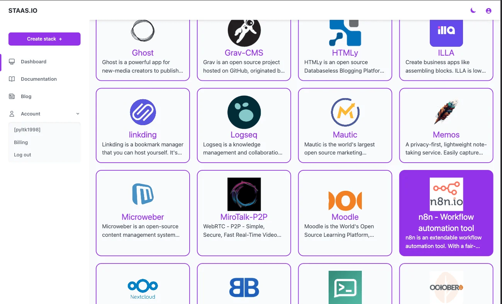
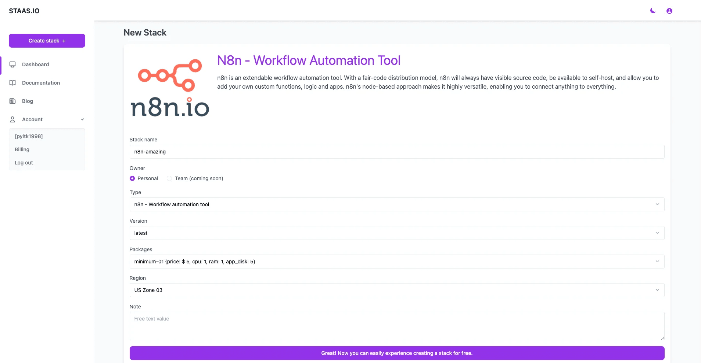
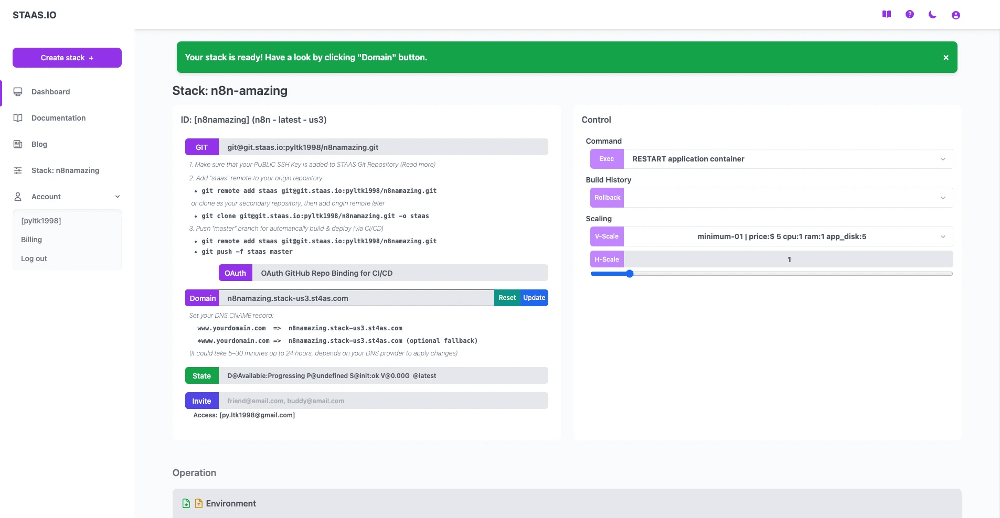
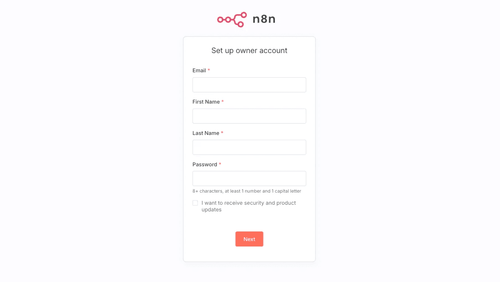
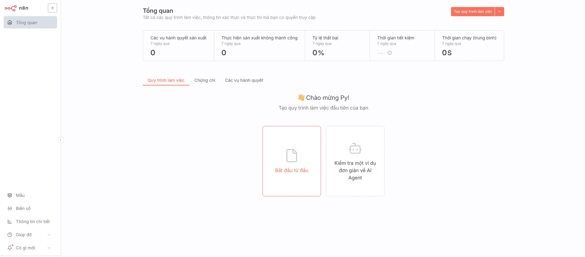

# Introduction
Complete this tutorial to deploy a sample N8N app via Staas.io without any additional tool/knowledge.

Requirements:
- A verified Staas.io account.

## Creating your first Stack with Staas.io

N8n is an extendable workflow automation tool. With a fair-code distribution model, n8n will always have visible source code, be available to self-host, and allow you to add your own custom functions, logic and apps. n8n's node-based approach makes it highly versatile, enabling you to connect anything to everything.

### Instance Creation
Staas.io gives you more controls with the instance you run your app on.

Go to your [Staas.io Dashboard](https://www.staas.io/dashboard?utm_source=docs)

Click on [Create new stack +](https://www.staas.io/dashboard/stack_selector){: .btn .btn-purple .ml-2 .mr-2 }.
From this screen, you can select your stack of choice including Programming Languages, Databases and Applications. In this tutorial, we'll select "N8N - Workflow automation tool".

In the Create Stack page, configure your stack:
- **Stack name**: This is your stack name. It is also the name of your web domain once the stack is created.
- **Owner**: Set it as a private or a shared stack so that your team can contribute and maintain.
- **Type**: This is The stack type. It is the same as the previous page. In this case, "n8n - Workflow automation tool" is already selected.
- **Version**: Select a N8N's version. Let's select N8N latest for our example.
- **Packages**: This is your instance type. Choose your desired hardware's capability. The options are limited to your [Pricing plan](https://www.staas.io/#pricing).
- **Region**: Choose a region to deploy your stack. The app should be deployed closest to your target customers.

Press Create and your stack will be created momentarily. An email will be sent to you once it is created and ready to run.

### Manage your Stack in the Dashboard
Once you created the stack, you will be greeted with a Stack Management screen.

In this screen, you can pretty much control everything regarding to your stack/instance with just a few mouse clicks.

Checking out your new domain by clicking on [Domain](#){: .btn .btn-purple .ml-2 } button. It will open up your designated domain in a new tab.

## Set up your N8N page
You will be greeted with the "owner account setup" process. Here you fill in the necessary information such as: *email, first name, last name, password* to create an admin account for your N8N application.

Once done, you will be on "N8N Dashboard". Great, now let’s "create our first workflow".

Congratulations, you have successfully deployed your N8N app through just a few steps with Staas.io
