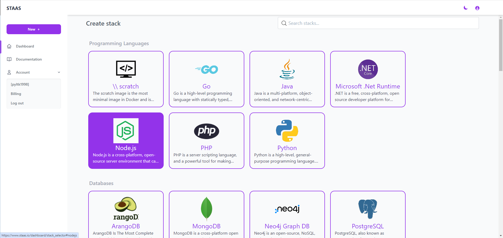
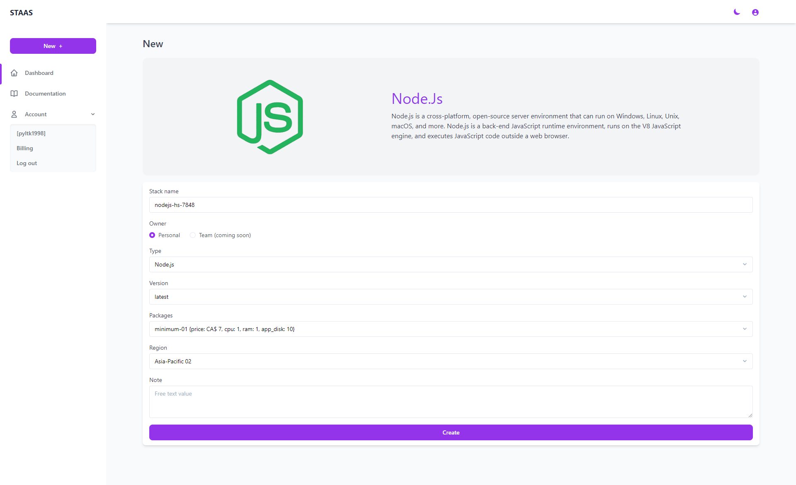
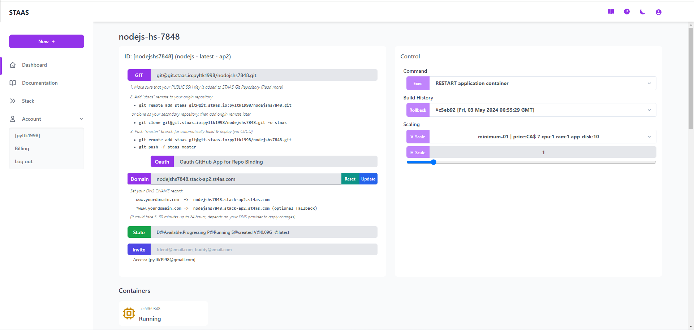
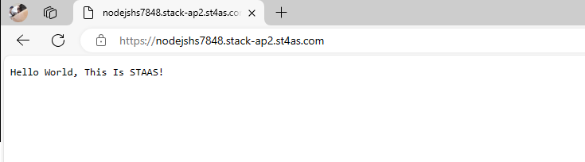
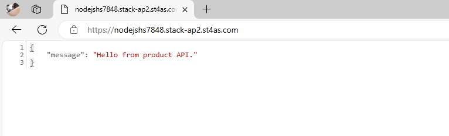
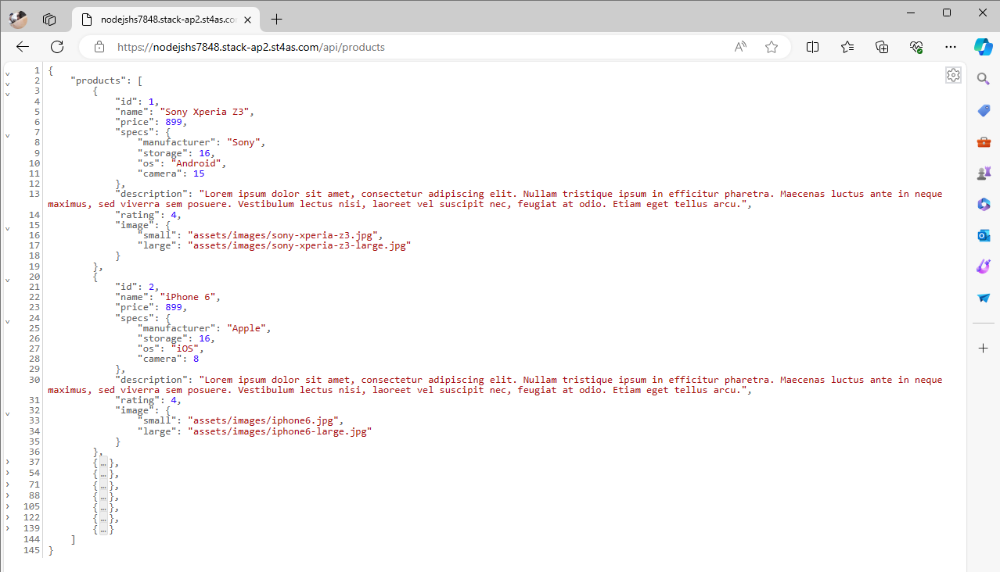

# Introduction
Complete this tutorial to deploy a sample NodeJS FastAPI app to Staas.

Requirements:
- A verified Staas.io account.
<!-- -->
- [Git](https://git-scm.com/) installed. If you don't have Git installed, please complete the guides before proceeding:
    - [Git installation](https://git-scm.com/book/en/v2/Getting-Started-Installing-Git)
    - [First-time setup](https://git-scm.com/book/en/v2/Getting-Started-First-Time-Git-Setup)


## Creating your first Stack with Staas.io

### Instance Creation
Staas.io gives you more controls with the instance you run your app on.

Go to your [Staas.io Dashboard](https://www.staas.io/dashboard)


Click on [Create new stack +](){: .btn .btn-purple .ml-2 .mr-2 }.
From this screen, you can select your stack of choice including Programming Languages, Databases and Applications. In this tutorial, we'll select NodeJS.


In the Create Stack page, configure your stack:
- **Stack name**: This is your stack name. It is also the name of your web domain once the stack is created.
- **Owner**: Set it as a private or a shared stack so that your team can contribute and maintain.
- **Type**: This is The stack type. It is the same as the previous page. In this case, NodeJS is already selected.
- **Version**: Select a NodeJS's version. Let's select NodeJS latest for our example.
- **Packages**: This is your instance type. Choose your desired hardware's capability. The options are limited to your [Pricing plan](https://www.staas.io/#pricing).
- **Region**: Choose a region to deploy your stack. The app should be deployed closest to your target customers.


Press Create and your stack will be created momentarily. An email will be sent to you once it is created and ready to run.

### Manage your Stack in the Dashboard
Once you created the stack, you will be greeted with a Stack Management screen.



In this screen, you can pretty much control everything regarding to your stack/instance with just a few mouse clicks.

Checking out your new domain by clicking on [Domain](){: .btn .btn-purple .ml-2 .mr-2 } button. It will open up your designated domain in a new tab. For now, it is just a basic page with a "Hello World, This Is STAAS!" message.



## Set up the App

### Setting up SSH key

You must setup your SSH key with your account in order to push to your Staas.io remote. This process is done once and it will be associcated with your account.

Please read [SSH Keys]() page to learn how to create your SSH key.

Now go to your Stass.io [Profile](https://www.staas.io/dashboard/profile) page. In the Security section at the bottom, paste your SSH public key in the "New RSA public key with valid format" input box and press Add.


Now you can select your public key in the "Public keys" dropdown just above.

That's it for the SSH key setup. You can now push your code to your Staas.io's remote.

### Deploying the app
Clone the sample FastAPI app that Staas had prepared for you. Execute these in your local terminal:
```
$ git clone git@git.staas.io:pyltk1998/nodejshs7848.git -o staas
$ cd nodejshs7848
```

Now back to the dashboard.

Click on the [GIT](){: .btn .btn-purple .ml-2 } button, you will see a Git remote URI and some instructions on how to deploy the code to your stack instance. Git remotes are versions of your repository that live on other servers. You deploy your app by pushing its code to that Staas remote associated with your app.


Here's how to do it with this repo:
- Set a new remote to the repo, remember to replace the remomte URI with yours URI:
```
# git remote add staas <your_remote_URI>
$ git remote add staas git@git.staas.io:pyltk1998/nodejshs7848.git
```

- To deploy this to Staas, simply run this command to push the `master` branch of the repo to your Staas remote (one for master branch, then to copy over to deploy branch). Staas will automatically deploy your app:

```shell
$ git push -f staas master
Enumerating objects: 6, done.
Counting objects: 100% (6/6), done.
Delta compression using up to 4 threads
Compressing objects: 100% (4/4), done.
Writing objects: 100% (4/4), 3.16 KiB | 3.16 MiB/s, done.
Total 4 (delta 2), reused 0 (delta 0), pack-reused 0 (from 0)
remote: INFO: git-hook/post-receive: nodejshs7848/master
remote: INFO: Hook on 'master' as default 'deploy' branch. Deploying...
remote: ---
remote: BOF
remote: Branch: master
remote: commit 564761cf23ed0babf5f34c1319a281f4825627a2
remote: Author: Py1409
remote: Date:   Fri May 3 14:30:52 2024 +0700
remote:     fix
remote: GITHOOK --> Builder #2c304d75c4ebd8bd6c42684d7ba59c3056a23c15
remote: CONFIG --> Stack info exist
remote: RESOURCES --> Current resources: DISK_SIZE = 2Gi [2Gi]
remote: Info: VOLUME --> Volume f32d06d0--nodejshs7848-nodejs exist
remote: BUILD --> Source size: 288K     . 288   .
remote: BUILD --> Commit: 564761cf23ed0babf5f34c1319a281f4825627a2
remote: IMAGE_CHECK --> tag: docker.io/registryhub/staas-nodejs:pyltk1998.nodejshs7848.564761cf
remote: IMAGE_BUILD --> Preparing build args from environments
remote: IMAGE_BUILD --> Pulling build log in 10s
remote: INFO[0002] Retrieving image manifest node:alpine
remote: INFO[0002] Retrieving image node:alpine from registry index.docker.io
remote: INFO[0003] Retrieving image manifest node:alpine
remote: INFO[0003] Returning cached image manifest
remote: INFO[0004] Built cross stage deps: map[]
remote: INFO[0004] Retrieving image manifest node:alpine
remote: INFO[0004] Returning cached image manifest
remote: INFO[0004] Retrieving image manifest node:alpine
remote: INFO[0004] Returning cached image manifest
remote: INFO[0004] Executing 0 build triggers
remote: INFO[0004] Building stage node:alpine [idx: 0, base-idx: -1]
remote: INFO[0006] Using caching version of cmd: RUN apk add --update --no-cache --virtual .node-gyp git curl bash zip wget build-base g++ make python3 py3-pip && npm install -g node-gyp
remote: INFO[0006] Resolving srcs [*.json]...
remote: INFO[0007] No cached layer found for cmd RUN npm install --force || true; npm prune --production
remote: INFO[0007] Unpacking rootfs as cmd COPY *.json ./ requires it.
remote: INFO[0011] ARG STAAS_BUILD_MODE=safe
remote: INFO[0011] No files changed in this command, skipping snapshotting.
remote: INFO[0011] ENV NODE_ENV=production
remote: INFO[0011] No files changed in this command, skipping snapshotting.
remote: INFO[0011] RUN apk add --update --no-cache --virtual .node-gyp git curl bash zip wget build-base g++ make python3 py3-pip && npm install -g node-gyp
remote: INFO[0011] Found cached layer, extracting to filesystem
remote: INFO[0017] WORKDIR /app
remote: INFO[0017] Cmd: workdir
remote: INFO[0017] Changed working directory to /app
remote: INFO[0017] Creating directory /app with uid -1 and gid -1
remote: INFO[0017] Taking snapshot of files...
remote: INFO[0017] Resolving srcs [*.json]...
remote: INFO[0017] COPY *.json ./
remote: INFO[0017] Resolving srcs [*.json]...
remote: INFO[0017] Taking snapshot of files...
remote: INFO[0017] RUN npm install --force || true; npm prune --production
remote: INFO[0017] Initializing snapshotter ...
remote: INFO[0017] Taking snapshot of full filesystem...
remote: INFO[0020] Cmd: /bin/sh
remote: INFO[0020] Args: [-c npm install --force || true; npm prune --production]
remote: INFO[0020] Running: [/bin/sh -c npm install --force || true; npm prune --production]
remote: npm warn using --force Recommended protections disabled.
remote: added 60 packages, and audited 61 packages in 1s
remote: 10 packages are looking for funding
remote:   run `npm fund` for details
remote: 1 moderate severity vulnerability
remote: To address all issues, run:
remote:   npm audit fix
remote: Run `npm audit` for details.
remote: npm warn config production Use `--omit=dev` instead.
remote: up to date, audited 61 packages in 891ms
remote: 10 packages are looking for funding
remote:   run `npm fund` for details
remote: 1 moderate severity vulnerability
remote: To address all issues, run:
remote:   npm audit fix
remote: Run `npm audit` for details.
remote: INFO[0023] Taking snapshot of full filesystem...
remote: INFO[0024] COPY . ./
remote: INFO[0024] Taking snapshot of files...
remote: INFO[0024] RUN if [ ! "${STAAS_BUILD_MODE}" = "fast" ]; then npm install; npm prune --production; fi
remote: INFO[0024] Cmd: /bin/sh
remote: INFO[0024] Args: [-c if [ ! "${STAAS_BUILD_MODE}" = "fast" ]; then npm install; npm prune --production; fi]
remote: INFO[0024] Running: [/bin/sh -c if [ ! "${STAAS_BUILD_MODE}" = "fast" ]; then npm install; npm prune --production; fi]
remote: up to date, audited 61 packages in 952ms
remote: 10 packages are looking for funding
remote:   run `npm fund` for details
remote: 1 moderate severity vulnerability
remote: To address all issues, run:
remote:   npm audit fix
remote: Run `npm audit` for details.
remote: npm warn config production Use `--omit=dev` instead.
remote: up to date, audited 61 packages in 897ms
remote: 10 packages are looking for funding
remote:   run `npm fund` for details
remote: 1 moderate severity vulnerability
remote: To address all issues, run:
remote:   npm audit fix
remote: Run `npm audit` for details.
remote: INFO[0026] Taking snapshot of full filesystem...
remote: INFO[0027] RUN apk del .node-gyp
remote: INFO[0027] Cmd: /bin/sh
remote: INFO[0027] Args: [-c apk del .node-gyp]
remote: INFO[0027] Running: [/bin/sh -c apk del .node-gyp]
remote: WARNING: opening from cache https://dl-cdn.alpinelinux.org/alpine/v3.19/main: No such file or directory
remote: WARNING: opening from cache https://dl-cdn.alpinelinux.org/alpine/v3.19/community: No such file or directory
remote: (1/58) Purging .node-gyp (20240503.065434)
remote: (2/58) Purging git (2.43.0-r0)
remote: (3/58) Purging curl (8.5.0-r0)
remote: (4/58) Purging bash (5.2.21-r0)
remote: Executing bash-5.2.21-r0.pre-deinstall
remote: (5/58) Purging zip (3.0-r12)
remote: (6/58) Purging unzip (6.0-r14)
remote: (7/58) Purging wget (1.21.4-r0)
remote: (8/58) Purging build-base (0.5-r3)
remote: (9/58) Purging file (5.45-r1)
remote: (10/58) Purging fortify-headers (1.1-r3)
remote: (11/58) Purging patch (2.7.6-r10)
remote: (12/58) Purging g++ (13.2.1_git20231014-r0)
remote: (13/58) Purging libstdc++-dev (13.2.1_git20231014-r0)
remote: (14/58) Purging gcc (13.2.1_git20231014-r0)
remote: (15/58) Purging binutils (2.41-r0)
remote: (16/58) Purging libatomic (13.2.1_git20231014-r0)
remote: (17/58) Purging libgomp (13.2.1_git20231014-r0)
remote: (18/58) Purging libc-dev (0.7.2-r5)
remote: (19/58) Purging musl-dev (1.2.4_git20230717-r4)
remote: (20/58) Purging make (4.4.1-r2)
remote: (21/58) Purging py3-pip-pyc (23.3.1-r0)
remote: (22/58) Purging py3-pip (23.3.1-r0)
remote: (23/58) Purging py3-setuptools-pyc (68.2.2-r0)
remote: (24/58) Purging py3-setuptools (68.2.2-r0)
remote: (25/58) Purging py3-packaging-pyc (23.2-r0)
remote: (26/58) Purging py3-packaging (23.2-r0)
remote: (27/58) Purging py3-parsing-pyc (3.1.1-r0)
remote: (28/58) Purging py3-parsing (3.1.1-r0)
remote: (29/58) Purging isl26 (0.26-r1)
remote: (30/58) Purging jansson (2.14-r4)
remote: (31/58) Purging libcurl (8.5.0-r0)
remote: (32/58) Purging ca-certificates (20240226-r0)
remote: Executing ca-certificates-20240226-r0.post-deinstall
remote: (33/58) Purging libidn2 (2.3.4-r4)
remote: (34/58) Purging libmagic (5.45-r1)
remote: (35/58) Purging libunistring (1.1-r2)
remote: (36/58) Purging mpc1 (1.3.1-r1)
remote: (37/58) Purging mpfr4 (4.2.1-r0)
remote: (38/58) Purging nghttp2-libs (1.58.0-r0)
remote: (39/58) Purging pcre2 (10.42-r2)
remote: (40/58) Purging python3-pyc (3.11.9-r0)
remote: (41/58) Purging python3-pycache-pyc0 (3.11.9-r0)
remote: (42/58) Purging pyc (3.11.9-r0)
remote: (43/58) Purging zstd-libs (1.5.5-r8)
remote: (44/58) Purging brotli-libs (1.1.0-r1)
remote: (45/58) Purging c-ares (1.27.0-r0)
remote: (46/58) Purging python3 (3.11.9-r0)
remote: (47/58) Purging gdbm (1.23-r1)
remote: (48/58) Purging gmp (6.3.0-r0)
remote: (49/58) Purging libbz2 (1.0.8-r6)
remote: (50/58) Purging libexpat (2.6.2-r0)
remote: (51/58) Purging libffi (3.4.4-r3)
remote: (52/58) Purging libpanelw (6.4_p20231125-r0)
remote: (53/58) Purging readline (8.2.1-r2)
remote: (54/58) Purging libncursesw (6.4_p20231125-r0)
remote: (55/58) Purging ncurses-terminfo-base (6.4_p20231125-r0)
remote: (56/58) Purging mpdecimal (2.5.1-r2)
remote: (57/58) Purging sqlite-libs (3.44.2-r0)
remote: (58/58) Purging xz-libs (5.4.5-r0)
remote: Executing busybox-1.36.1-r15.trigger
remote: OK: 10 MiB in 17 packages
remote: INFO[0027] Taking snapshot of full filesystem...
remote: INFO[0027] CMD ["npm", "start"]
remote: INFO[0027] No files changed in this command, skipping snapshotting.
remote: INFO[0032] Pushing image to docker.io/registryhub/staas-nodejs:pyltk1998.nodejshs7848
remote: INFO[0039] Pushed index.docker.io/registryhub/staas-nodejs@sha256:3659eac050fb1a43db08bdd4ac39afad4b8823ebd5d3e34643a34e89a5e72d18
remote: INFO[0039] Pushing image to docker.io/registryhub/staas-nodejs:pyltk1998.nodejshs7848.564761cf
remote: INFO[0043] Pushed index.docker.io/registryhub/staas-nodejs@sha256:3659eac050fb1a43db08bdd4ac39afad4b8823ebd5d3e34643a34e89a5e72d18
remote: IMAGE_BUILD --> Size: linux/amd64   173.34M
remote: BUILD --> Build image: docker.io/registryhub/staas-nodejs:pyltk1998.nodejshs7848.564761cf
remote: BUILD --> Check available rollback images []
remote: DOMAIN --> Wildcard stack-ap2.st4as.com stack-ap2.st4as.com stack-ap2.st4as.com true
remote: BUILD --> Reconfigure restart strategy
remote: BUILD --> Update environment variables
remote: DEPLOY --> Check yaml done
remote: DEPLOY --> Deploy yaml done
remote: DEPLOY --> Tailing recent deployment logs in 30s
remote: DEPLOY --> Stack status phase: Running
remote: 2024-05-03T07:32:28.293977315Z
remote: 2024-05-03T07:32:28.294046714Z > learn01@1.0.0 start
remote: 2024-05-03T07:32:28.294054844Z > node app.js
remote: 2024-05-03T07:32:28.294059269Z
remote: 2024-05-03T07:32:28.497545215Z Product api server is listening at http://localhost:3030
remote: TTY --> Safely restart tty connections #[2]
remote: EOF
To git.staas.io:pyltk1998/nodejshs7848.git
   83b409d..564761c  master -> master
```

The application is deployed. You can visit the app by clicking [Domain](){: .btn .btn-purple .ml-2 .mr-2 } on the dashboard.





Congratulations, you have successfully deployed a NodeJS app with Staas.io.