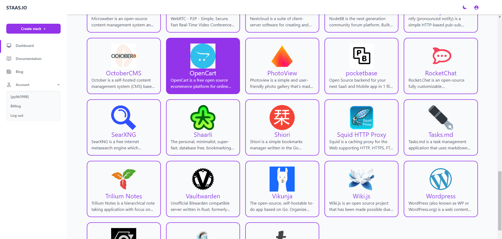
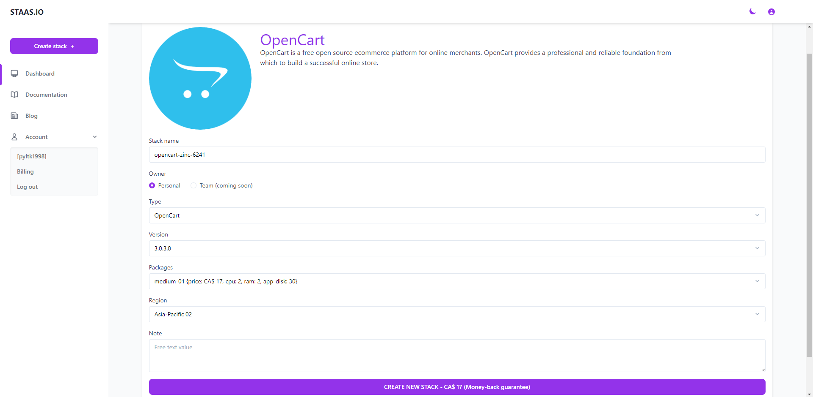
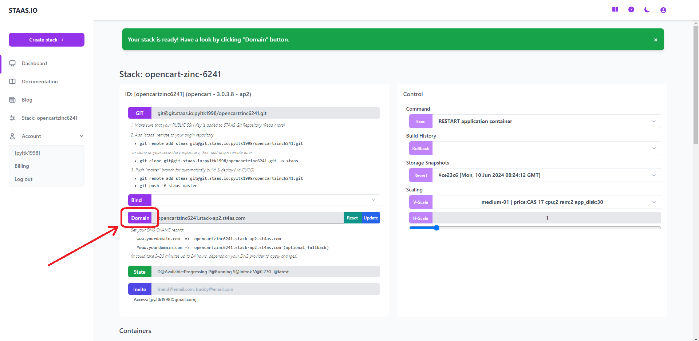
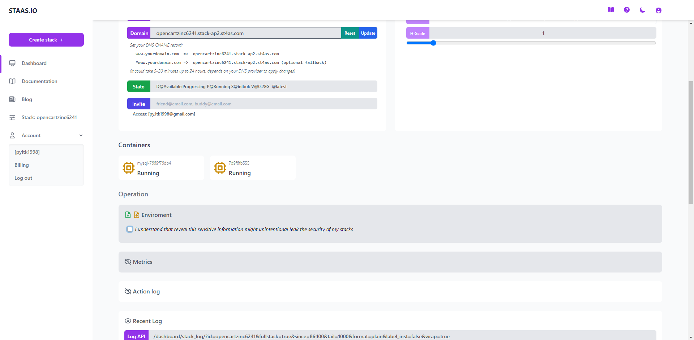
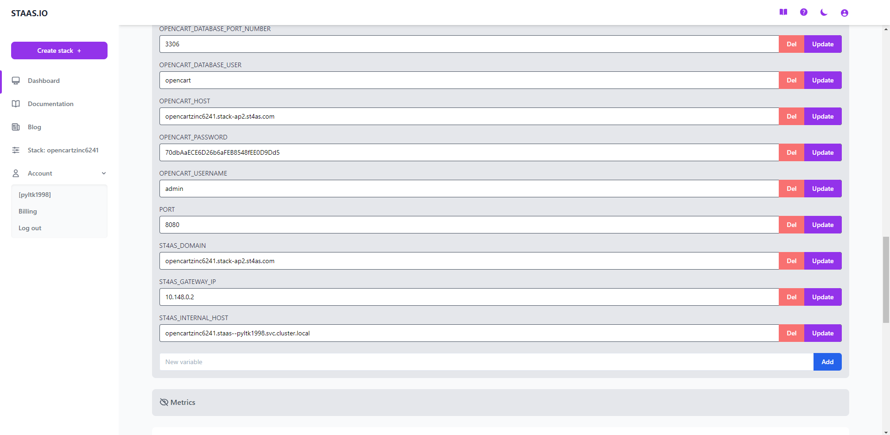

# Introduction
Complete this tutorial to deploy a sample OpenCart app via Staas.io without any additional tool/knowledge.

Requirements:
- A verified Staas.io account.

## Creating your first Stack with Staas.io
OpenCart is an open-source e-commerce platform used for building and managing online stores. It provides a robust and flexible system for creating and running an online business, allowing merchants to sell products and services over the internet.

### Instance Creation
Staas.io gives you more controls with the instance you run your app on.

Go to your [Staas.io Dashboard](https://www.staas.io/dashboard?utm_source=docs)

Click on "Create new stack +".
From this screen, you can select your stack of choice including Programming Languages, Databases and Applications. In this tutorial, we'll select **OpenCart**.

In the Create Stack page, configure your stack:
- **Stack name**: This is your stack name. It is also the name of your web domain once the stack is created.
- **Owner**: Set it as a private or a shared stack so that your team can contribute and maintain.
- **Type**: This is The stack type. It is the same as the previous page. In this case, OpenCart is already selected.
- **Version**: Select a OpenCart's version. Let's select OpenCart 3.0.3.8 for our example.
- **Packages**: This is your instance type. Choose your desired hardware's capability. The options are limited to your [Pricing plan](https://www.staas.io/#pricing).
- **Region**: Choose a region to deploy your stack. The app should be deployed closest to your target customers.

Press Create and your stack will be created momentarily. An email will be sent to you once it is created and ready to run.

### Manage your Stack in the Dashboard
Once you created the stack, you will be greeted with a Stack Management screen.

Checking out your new domain by clicking on [Domain](){: .btn .btn-purple .ml-2 } button. It will open up your designated domain in a new tab.

**Address of the admin page that manages the website**: `<domain>`+`/admin`
For example, if your website domain name is *opencartzinc1409.stack-ap2.st4as.com*, then your website management admin page address is *opencartzinc1409.stack-ap2.st4as.com/admin*

**Administrator account managing the website**
At the "Manage your Stack in the Dashboard" page, you will see a section named "Operation/Environment," where you will find information about the OpenCart website's environment variables. You need to checked the checkbox "I understand that revealing this sensitive information might unintentionally leak the security of my stacks" in order to see the environment information.

After checking the checkbox, you will see a lot of information about environment variables. Here we need to find the username and password information to log in to the website management page. Please look for the fields `OPENCART_USERNAME` and `OPENCART_PASSWORD`, those are the admin account details for managing your OpenCart website.

## Congratulations to you
Congratulations, you have successfully deployed your OpenCart app through just a few steps with Staas.io

