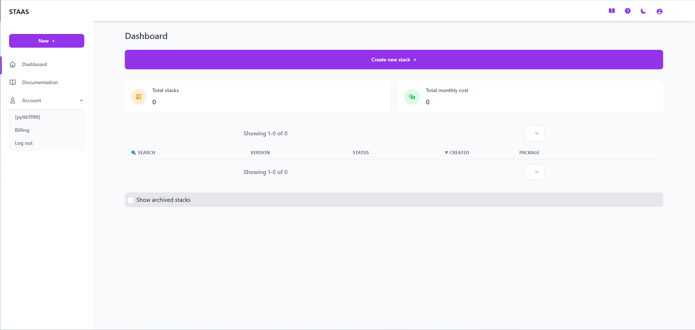
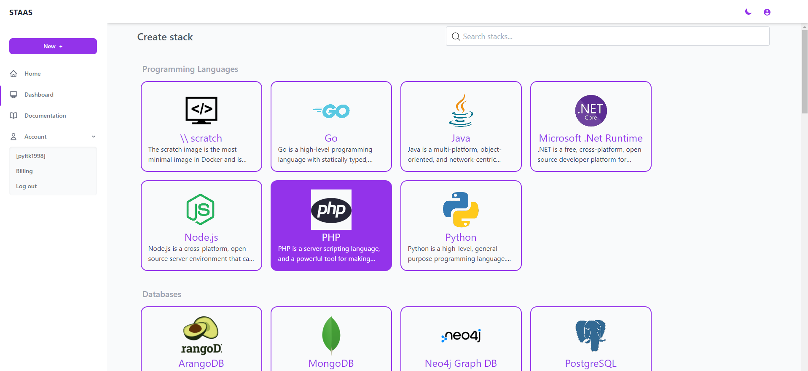
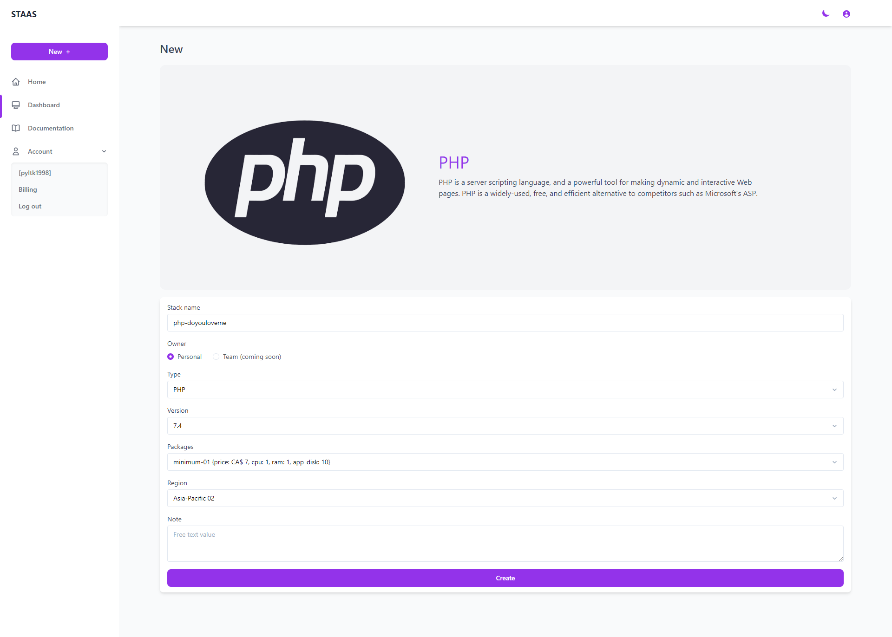
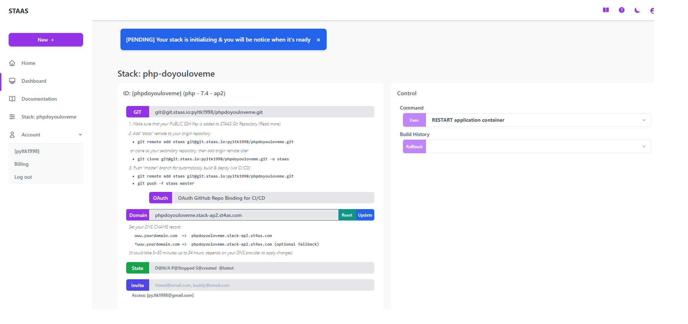
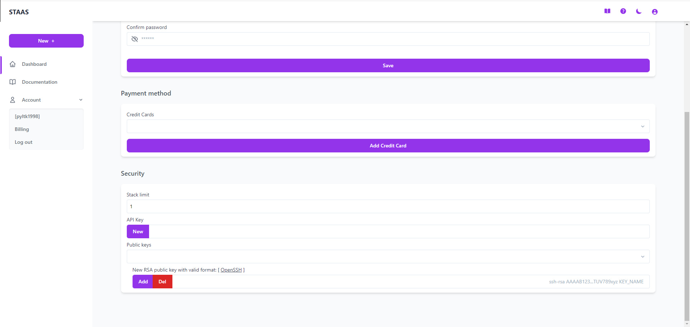
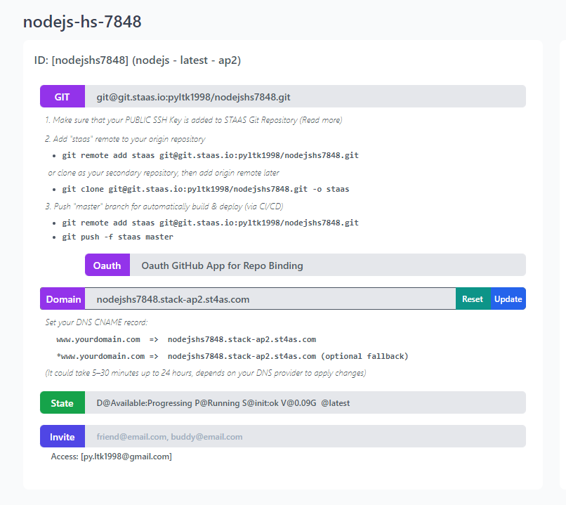
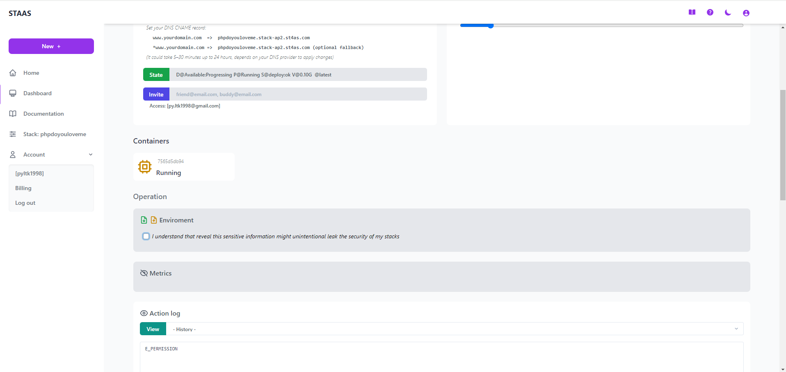
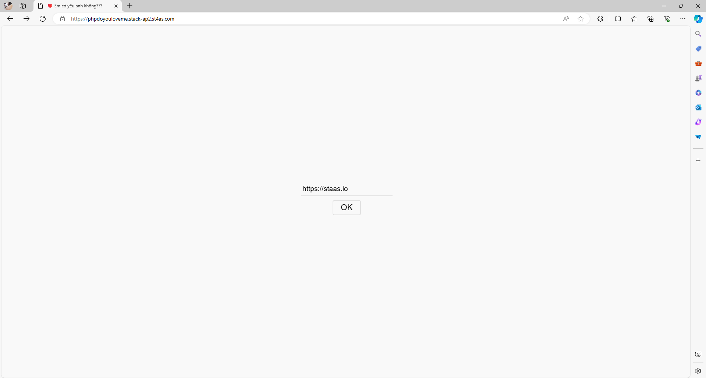

# Introduction
Complete this tutorial to deploy a sample PHP FastAPI app to Staas.

Requirements:
- A verified Staas.io account.
<!-- -->
- [Git](https://git-scm.com/) installed. If you don't have Git installed, please complete the guides before proceeding:
    - [Git installation](https://git-scm.com/book/en/v2/Getting-Started-Installing-Git)
    - [First-time setup](https://git-scm.com/book/en/v2/Getting-Started-First-Time-Git-Setup)


## Creating your first Stack with Staas.io

### Instance Creation
Staas.io gives you more controls with the instance you run your app on.

Go to your [Staas.io Dashboard](https://www.staas.io/dashboard?utm_source=docs)


Click on [Create new stack +](){: .btn .btn-purple .ml-2 .mr-2 }.
From this screen, you can select your stack of choice including Programming Languages, Databases and Applications. In this tutorial, we'll select PHP.


In the Create Stack page, configure your stack:
- **Stack name**: This is your stack name. It is also the name of your web domain once the stack is created.
- **Owner**: Set it as a private or a shared stack so that your team can contribute and maintain.
- **Type**: This is The stack type. It is the same as the previous page. In this case, PHP is already selected.
- **Version**: Select a PHP's version. Let's select PHP 7.4 for our example.
- **Packages**: This is your instance type. Choose your desired hardware's capability. The options are limited to your [Pricing plan](https://www.staas.io/#pricing).
- **Region**: Choose a region to deploy your stack. The app should be deployed closest to your target customers.


Press Create and your stack will be created momentarily. An email will be sent to you once it is created and ready to run.

### Manage your Stack in the Dashboard
Once you created the stack, you will be greeted with a Stack Management screen.



In this screen, you can pretty much control everything regarding to your stack/instance with just a few mouse clicks.

Checking out your new domain by clicking on [Domain](){: .btn .btn-purple .ml-2 .mr-2 } button. It will open up your designated domain in a new tab. For now, it is just a basic page with a "Hello World, This Is STAAS!" message.


## Set up the App

**→ Method 1: Using Git**

### Setting up SSH key

You must setup your SSH key with your account in order to push to your Staas.io remote. This process is done once and it will be associcated with your account.

Please read [SSH Keys]() page to learn how to create your SSH key.

Now go to your Stass.io [Profile](https://www.staas.io/dashboard/profile) page. In the Security section at the bottom, paste your SSH public key in the "New RSA public key with valid format" input box and press Add.


Now you can select your public key in the "Public keys" dropdown just above.

That's it for the SSH key setup. You can now push your code to your Staas.io's remote.

### Deploying the app
Clone the sample FastAPI app that Staas had prepared for you. Execute these in your local terminal:
```
$ git clone git@git.staas.io:pyltk1998/phpdoyouloveme.git -o staas
$ cd phpdoyouloveme
```

Now back to the dashboard.

Click on the [GIT](){: .btn .btn-purple .ml-2 } button, you will see a Git remote URI and some instructions on how to deploy the code to your stack instance. Git remotes are versions of your repository that live on other servers. You deploy your app by pushing its code to that Staas remote associated with your app.


Here's how to do it with this repo:
- Set a new remote to the repo, remember to replace the remomte URI with yours URI:
```
# git remote add staas <your_remote_URI>
$ git remote add staas git@git.staas.io:pyltk1998/phpdoyouloveme.git
```

- To deploy this to Staas, simply run this command to push the `master` branch of the repo to your Staas remote (one for master branch, then to copy over to deploy branch). Staas will automatically deploy your app:

```shell
$ git add .
$ git commit -m "<your-massage>"
$ git push -f staas master
Enumerating objects: 20, done.
Counting objects: 100% (20/20), done.
Delta compression using up to 4 threads
Compressing objects: 100% (18/18), done.
Writing objects: 100% (19/19), 3.87 MiB | 8.28 MiB/s, done.
Total 19 (delta 0), reused 0 (delta 0), pack-reused 0 (from 0)
remote: INFO: git-hook/post-receive: phpdoyouloveme/master
remote: INFO: Hook on 'master' as default 'deploy' branch. Deploying...
remote: ---
remote: BOF
remote: Branch: master
remote: commit 0f3f53c53b68faf6a7e9d970d49274d9aeff285a
remote: Author: Py1409 <Py.ltk1998@gmail.com>
remote: Date:   Mon May 6 13:29:47 2024 +0700
remote:     deploy
remote: GITHOOK --> Builder #344d1fd5f5aec2ccc7aafcf1c283a493f2179225
remote: CONFIG --> Stack info exist
remote: RESOURCES --> Current resources: DISK_SIZE = 2Gi [2Gi]
remote: Info: VOLUME --> Volume f32d06d0--phpdoyouloveme-php exist
remote: BUILD --> Source size: 8.3M     . 8468  .
remote: BUILD --> Commit: 0f3f53c53b68faf6a7e9d970d49274d9aeff285a
remote: IMAGE_CHECK --> tag: docker.io/registryhub/staas-php:pyltk1998.phpdoyouloveme.0f3f53c5
remote: IMAGE_BUILD --> Preparing build args from environments
remote: IMAGE_BUILD --> Pulling build log in 10s
remote: INFO[0001] Retrieving image manifest php:7.4-apache
remote: INFO[0001] Retrieving image php:7.4-apache from registry index.docker.io
remote: INFO[0003] Retrieving image manifest php:7.4-apache
remote: INFO[0003] Returning cached image manifest
remote: INFO[0003] Built cross stage deps: map[]
remote: INFO[0003] Retrieving image manifest php:7.4-apache
remote: INFO[0003] Returning cached image manifest
remote: INFO[0003] Retrieving image manifest php:7.4-apache
remote: INFO[0003] Returning cached image manifest
remote: INFO[0003] Executing 0 build triggers
remote: INFO[0003] Building stage php:7.4-apache [idx: 0, base-idx: -1]
remote: INFO[0003] Resolving srcs [*-install.sh]...
remote: INFO[0006] Using caching version of cmd: RUN chmod +x ./*.sh || true;
remote: INFO[0008] Using caching version of cmd: RUN if [ -f "pre-install.sh" ]; then sh -c ./pre-install.sh; fi
remote: INFO[0010] Using caching version of cmd: RUN if [ ! -z "${PACKAGES}" ]; then apt-get update && apt-get install -y $PACKAGES; fi
remote: INFO[0012] Using caching version of cmd: RUN if [ ! -z "${PECL}" ]; then pecl install $PECL; fi
remote: INFO[0014] Using caching version of cmd: RUN if [ ! -z "${DOCKER_PHP_EXT_INSTALL}" ]; then docker-php-ext-install $DOCKER_PHP_EXT_INSTALL; fi
remote: INFO[0016] Using caching version of cmd: RUN if [ ! -z "${DOCKER_PHP_EXT_ENABLE}" ]; then docker-php-ext-enable $DOCKER_PHP_EXT_ENABLE; fi
remote: INFO[0018] Using caching version of cmd: RUN if [ ! -z "${DOCKER_PHP_EXT_CONFIGURE}" ]]; then echo "${DOCKER_PHP_EXT_CONFIGURE}" | tr ";" "\n" | xargs docker-php-ext-configure; fi
remote: INFO[0020] Using caching version of cmd: RUN echo "$PHP_INI" | tr
remote: INFO[0021] Using caching version of cmd: RUN if [ ! -z "${A2ENMOD}" ]; then a2enmod $A2ENMOD; fi
remote: INFO[0023] Using caching version of cmd: RUN curl -sS https://getcomposer.org/installer | php -- --install-dir=/usr/local/bin --filename=composer
remote: INFO[0025] No cached layer found for cmd RUN if [ -f "composer.json" ]; then composer install --no-interaction --no-dev --prefer-dist; fi
remote: INFO[0025] Unpacking rootfs as cmd COPY *-install.sh ./ requires it.
remote: INFO[0036] ARG WORKDIR="/var/www/html"
remote: INFO[0036] No files changed in this command, skipping snapshotting.
remote: INFO[0036] ARG PACKAGES="curl libfreetype-dev libjpeg62-turbo-dev libpng-dev libmemcached-dev libssl-dev zlib1g-dev"
remote: INFO[0036] No files changed in this command, skipping snapshotting.
remote: INFO[0036] ARG PECL="memcached-3.2.0"
remote: INFO[0036] No files changed in this command, skipping snapshotting.
remote: INFO[0036] ARG DOCKER_PHP_EXT_ENABLE="memcached"
remote: INFO[0036] No files changed in this command, skipping snapshotting.
remote: INFO[0036] ARG DOCKER_PHP_EXT_INSTALL="opcache"
remote: INFO[0036] No files changed in this command, skipping snapshotting.
remote: INFO[0036] ARG DOCKER_PHP_EXT_CONFIGURE="gd --with-freetype --with-jpeg"
remote: INFO[0036] No files changed in this command, skipping snapshotting.
remote: INFO[0036] ARG PHP_INI="upload_max_filesize = 10M;post_max_size = 10M;"
remote: INFO[0036] No files changed in this command, skipping snapshotting.
remote: INFO[0036] ARG A2ENMOD="rewrite"
remote: INFO[0036] No files changed in this command, skipping snapshotting.
remote: INFO[0036] ENV COMPOSER_ALLOW_SUPERUSER=1
remote: INFO[0036] No files changed in this command, skipping snapshotting.
remote: INFO[0036] WORKDIR $WORKDIR
remote: INFO[0036] Cmd: workdir
remote: INFO[0036] Changed working directory to /var/www/html
remote: INFO[0036] No files changed in this command, skipping snapshotting.
remote: INFO[0036] Resolving srcs [*-install.sh]...
remote: INFO[0036] COPY *-install.sh ./
remote: INFO[0036] Resolving srcs [*-install.sh]...
remote: INFO[0036] Taking snapshot of files...
remote: INFO[0036] RUN chmod +x ./*.sh || true;
remote: INFO[0036] Found cached layer, extracting to filesystem
remote: INFO[0036] RUN if [ -f "pre-install.sh" ]; then sh -c ./pre-install.sh; fi
remote: INFO[0036] Found cached layer, extracting to filesystem
remote: INFO[0037] RUN if [ ! -z "${PACKAGES}" ]; then apt-get update && apt-get install -y $PACKAGES; fi
remote: INFO[0037] Found cached layer, extracting to filesystem
remote: INFO[0039] RUN if [ ! -z "${PECL}" ]; then pecl install $PECL; fi
remote: INFO[0039] Found cached layer, extracting to filesystem
remote: INFO[0039] RUN if [ ! -z "${DOCKER_PHP_EXT_INSTALL}" ]; then docker-php-ext-install $DOCKER_PHP_EXT_INSTALL; fi
remote: INFO[0039] Found cached layer, extracting to filesystem
remote: INFO[0040] RUN if [ ! -z "${DOCKER_PHP_EXT_ENABLE}" ]; then docker-php-ext-enable $DOCKER_PHP_EXT_ENABLE; fi
remote: INFO[0040] Found cached layer, extracting to filesystem
remote: INFO[0041] RUN if [ ! -z "${DOCKER_PHP_EXT_CONFIGURE}" ]]; then echo "${DOCKER_PHP_EXT_CONFIGURE}" | tr ";" "\n" | xargs docker-php-ext-configure; fi
remote: INFO[0041] Found cached layer, extracting to filesystem
remote: INFO[0045] RUN echo "$PHP_INI" | tr
remote: INFO[0045] Found cached layer, extracting to filesystem
remote: INFO[0046] RUN if [ ! -z "${A2ENMOD}" ]; then a2enmod $A2ENMOD; fi
remote: INFO[0046] Found cached layer, extracting to filesystem
remote: INFO[0046] RUN curl -sS https://getcomposer.org/installer | php -- --install-dir=/usr/local/bin --filename=composer
remote: INFO[0046] Found cached layer, extracting to filesystem
remote: INFO[0047] COPY . .
remote: INFO[0047] Taking snapshot of files...
remote: INFO[0047] RUN if [ -f "composer.json" ]; then composer install --no-interaction --no-dev --prefer-dist; fi
remote: INFO[0047] Initializing snapshotter ...
remote: INFO[0047] Taking snapshot of full filesystem...
remote: INFO[0054] Cmd: /bin/sh
remote: INFO[0054] Args: [-c if [ -f "composer.json" ]; then composer install --no-interaction --no-dev --prefer-dist; fi]
remote: INFO[0054] Running: [/bin/sh -c if [ -f "composer.json" ]; then composer install --no-interaction --no-dev --prefer-dist; fi]
remote: INFO[0054] Taking snapshot of full filesystem...
remote: INFO[0056] No files were changed, appending empty layer to config. No layer added to image.
remote: INFO[0056] RUN if [ -f "post-install.sh" ]; then sh -c ./post-install.sh;fi
remote: INFO[0056] Cmd: /bin/sh
remote: INFO[0056] Args: [-c if [ -f "post-install.sh" ]; then sh -c ./post-install.sh;fi]
remote: INFO[0056] Running: [/bin/sh -c if [ -f "post-install.sh" ]; then sh -c ./post-install.sh;fi]
remote: post-install.sh
remote: INFO[0056] Taking snapshot of full filesystem...
remote: INFO[0057] No files were changed, appending empty layer to config. No layer added to image.
remote: INFO[0057] Cmd: /bin/sh
remote: INFO[0057] Taking snapshot of full filesystem...
remote: INFO[0059] No files were changed, appending empty layer to config. No layer added to image.
remote: INFO[0063] Pushing image to docker.io/registryhub/staas-php:pyltk1998.phpdoyouloveme
remote: INFO[0071] Pushed index.docker.io/registryhub/staas-php@sha256:b21ceb1e1d48b44f4376b34231b8a0695414d0825e12f44f302dd68d34f2b029
remote: INFO[0071] Pushing image to docker.io/registryhub/staas-php:pyltk1998.phpdoyouloveme.0f3f53c5
remote: INFO[0075] Pushed index.docker.io/registryhub/staas-php@sha256:b21ceb1e1d48b44f4376b34231b8a0695414d0825e12f44f302dd68d34f2b029
remote: IMAGE_BUILD --> Size: linux/amd64   208.94M
remote: BUILD --> Build image: docker.io/registryhub/staas-php:pyltk1998.phpdoyouloveme.0f3f53c5
remote: BUILD --> Check available rollback images []
remote: DOMAIN --> Wildcard stack-ap2.st4as.com stack-ap2.st4as.com stack-ap2.st4as.com true
remote: BUILD --> Reconfigure restart strategy
remote: BUILD --> Update environment variables
remote: DEPLOY --> Check yaml done
remote: DEPLOY --> Deploy yaml done
remote: DEPLOY --> Tailing recent deployment logs in 30s
remote: DEPLOY --> Stack status phase: Running
remote: 2024-05-06T06:32:05.941125531Z [Mon May 06 06:32:05.940974 2024] [mpm_prefork:notice] [pid 1] AH00163: Apache/2.4.54 (Debian) PHP/7.4.33 configured -- resuming normal operations
remote: 2024-05-06T06:32:05.953632940Z Mon May  6 06:32:05 UTC 2024: Unknown command: auto
remote: 2024-05-06T06:32:05.965371881Z [Mon May  6 06:32:05 2024] PHP 8.2.6 Development Server (http://0.0.0.0:808) started
remote: TTY --> Safely restart tty connections #[2]
remote: EOF
To git.staas.io:pyltk1998/phpdoyouloveme.git
   a9e7646..0f3f53c  master -> master
```

**→ Method 2: Using Filemanager**

On the `Stack Management` screen, scroll down to see the `Operation` section, here you check `I understand that reveal this sensitive information might unintentionally leak the security of my stacks`, you will see the Enviroment information (this is important information, please manage it carefully). You find information such as `FILEMANAGER_DOMAIN`, password `FILEMANAGER_PASSWORD` and username `FILEMANAGER_USERNAME` (these are information for you to control Filemanager).
You can learn more about [Common Variables on Staas.io](https://docs.staas.io/docs/the-basics/enviroment.html#common-variables-on-staasio)



Please access the path `FILEMANAGER_DOMAIN` with username and password, be provided. Then you proceed to upload your website source code to the "data" folder.


The application is deployed. You can visit the app by clicking [Domain](){: .btn .btn-purple .ml-2 .mr-2 } on the dashboard.



Congratulations, you have successfully deployed a PHP app with Staas.io.