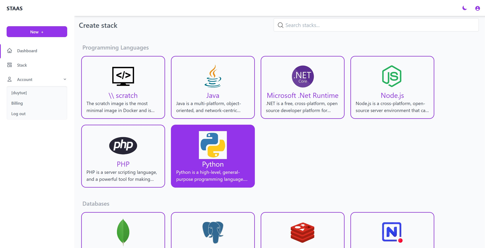
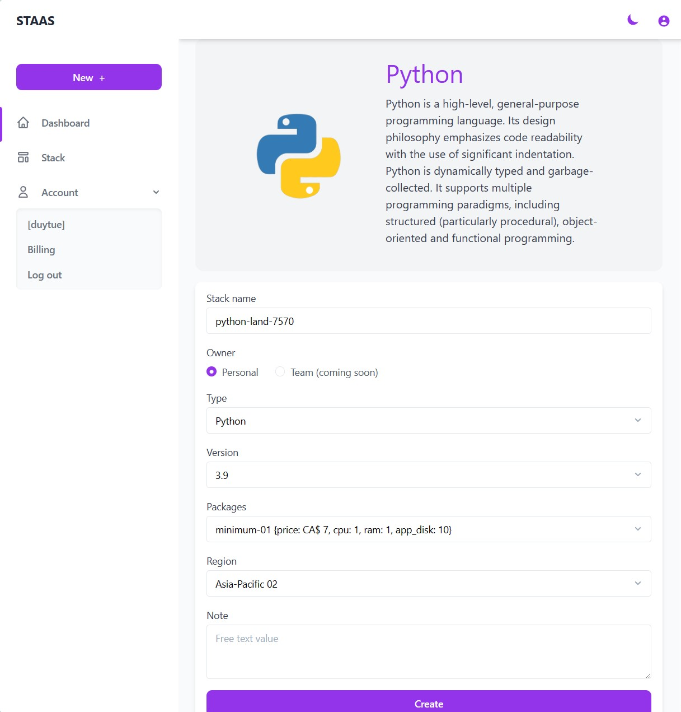
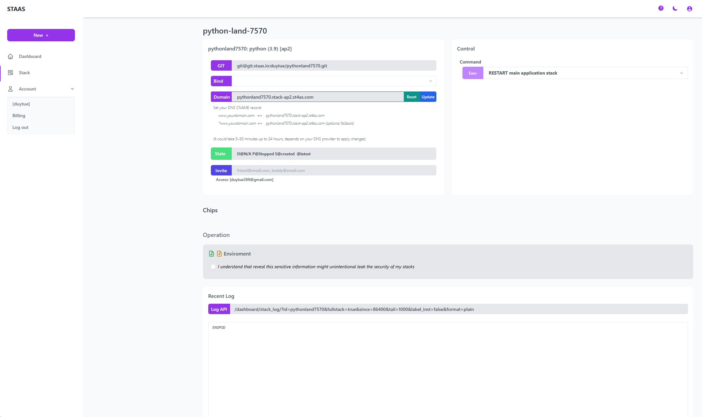
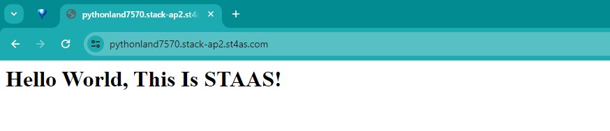
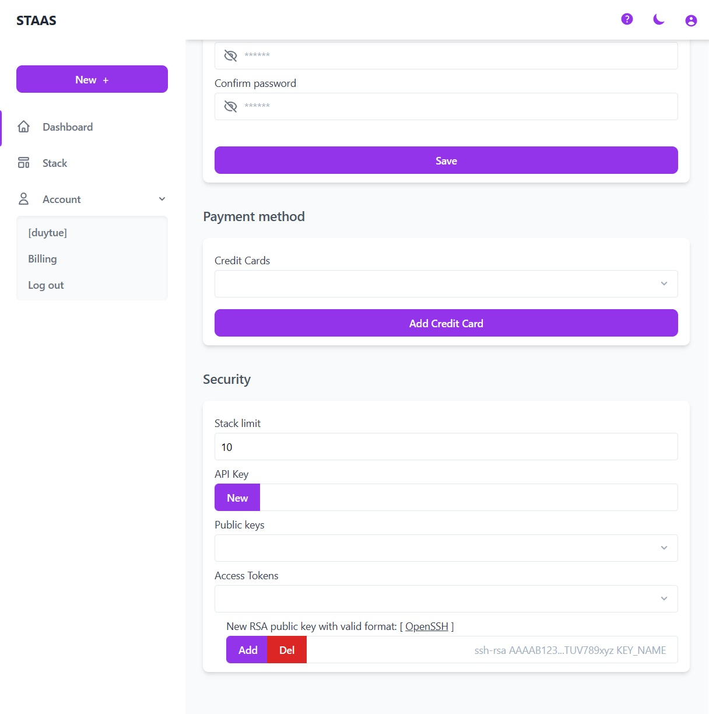
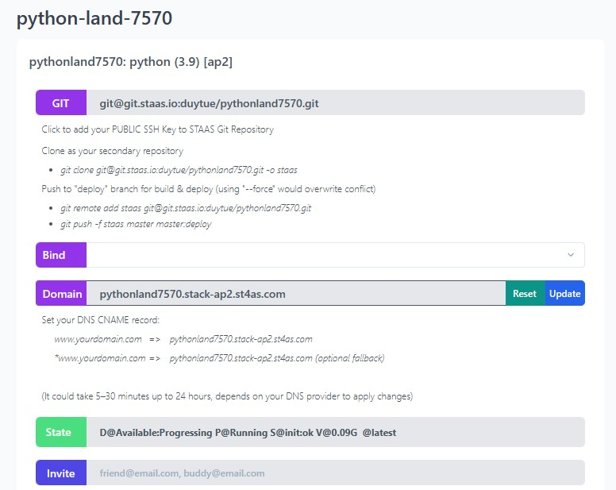

# Introduction
Complete this tutorial to deploy a sample Python FastAPI app to Staas.

Requirements:
- A verified Staas.io account.
<!-- - Python 3.9 installed locally - see the Python's official installation guides for [OS X](https://docs.python-guide.org/starting/install3/osx/), [Windows](https://docs.python-guide.org/starting/install3/win/), and [Linux](https://docs.python-guide.org/starting/install3/linux/). -->
- [Git](https://git-scm.com/) installed. If you don't have Git installed, please complete the guides before proceeding:
    - [Git installation](https://git-scm.com/book/en/v2/Getting-Started-Installing-Git)
    - [First-time setup](https://git-scm.com/book/en/v2/Getting-Started-First-Time-Git-Setup)


## Creating your first Stack with Staas.io

### Instance Creation
Staas.io gives you more controls with the instance you run your app on.

Go to your [Staas.io Dashboard](https://www.staas.io/dashboard?utm_source=docs)


Click on [Create new stack +](){: .btn .btn-purple .ml-2 .mr-2 }.
From this screen, you can select your stack of choice including Programming Languages, Databases and Applications. In this tutorial, we'll select Python.


In the Create Stack page, configure your stack:
- **Stack name**: This is your stack name. It is also the name of your web domain once the stack is created.
- **Owner**: Set it as a private or a shared stack so that your team can contribute and maintain.
- **Type**: This is The stack type. It is the same as the previous page. In this case, Python is already selected.
- **Version**: Select a Python's version. Let's select Python 3.9.9 for our example.
- **Packages**: This is your instance type. Choose your desired hardware's capability. The options are limited to your [Pricing plan](https://www.staas.io/#pricing).
- **Region**: Choose a region to deploy your stack. The app should be deployed closest to your target customers.


Press Create and your stack will be created momentarily. An email will be sent to you once it is created and ready to run.

### Manage your Stack in the Dashboard
Once you created the stack, you will be greeted with a Stack Management screen.



In this screen, you can pretty much control everything regarding to your stack/instance with just a few mouse clicks.

Checking out your new domain by clicking on [Domain](){: .btn .btn-purple .ml-2 .mr-2 } button. It will open up your designated domain in a new tab. For now, it is just a basic page with a "Hello World, This Is STAAS!" message.



## Set up the App

### Setting up SSH key

You must setup your SSH key with your account in order to push to your Staas.io remote. This process is done once and it will be associcated with your account.

Please read [SSH Keys]() page to learn how to create your SSH key.

Now go to your Stass.io [Profile](https://www.staas.io/dashboard/profile) page. In the Security section at the bottom, paste your SSH public key in the "New RSA public key with valid format" input box and press Add.


Now you can select your public key in the "Public keys" dropdown just above.

That's it for the SSH key setup. You can now push your code to your Staas.io's remote.

### Deploying the app
Clone the sample FastAPI app that Staas had prepared for you. Execute these in your local terminal:
```
$ git clone https://github.com/staas-io/getting-started-python.git
$ cd getting-started-python
```

Now back to the dashboard.

Click on the [GIT](){: .btn .btn-purple .ml-2 } button, you will see a Git remote URI and some instructions on how to deploy the code to your stack instance. Git remotes are versions of your repository that live on other servers. You deploy your app by pushing its code to that Staas remote associated with your app.


Here's how to do it with this repo:
- Set a new remote to the repo, remember to replace the remomte URI with yours URI:
```
# git remote add staas <your_remote_URI>
$ git remote add staas git@git.staas.io:duytue/pythonland7570.git
```

- To deploy this to Staas, simply run this command to push the `master` branch of the repo to your Staas remote (one for master branch, then to copy over to deploy branch). Staas will automatically deploy your app:

```shell
$ git push -f staas master master:deploy
Enumerating objects: 12, done.
Counting objects: 100% (12/12), done.
Delta compression using up to 12 threads
Compressing objects: 100% (9/9), done.
Writing objects: 100% (12/12), 3.78 KiB | 1.89 MiB/s, done.
Total 12 (delta 1), reused 2 (delta 0), pack-reused 0
remote: INFO: git-hook/post-receive: pythonland7570/deploy
remote: INFO: Branch deploy
remote: ---
remote: BOF
remote: WORKER.NAMESPACE staas--duytue
remote: GITHOOK --> Builder signature: commit fe1e589dfe2cd4176cbf0273f9156a45a768dd09
remote: CONFIG --> Stack info exist
remote: namespace/staas--duytue not labeled
remote: RESOURCES --> Current resources: DISK_SIZE = 2Gi [2Gi]
remote: Warning: VOLUME --> Volume bb32c670--pythonland7570-python exist
remote: BUILD --> Source size: 224K     . 224   .
remote: Git Commit Hash: 3835a97835d6bf41199049d4aac852280ad6dfe8
remote: Flag: build_init_only=
remote: IMAGE_CHECK --> tag: docker.io/registryhub/staas-python:duytue.pythonland7570.3835a978
remote: IMAGE_BUILD --> Pulling build log in 10s
remote: INFO[0001] Retrieving image manifest python:3.9-alpine
remote: INFO[0001] Retrieving image python:3.9-alpine from registry index.docker.io
remote: INFO[0004] Retrieving image manifest python:3.9-alpine
remote: INFO[0004] Returning cached image manifest
remote: INFO[0004] Built cross stage deps: map[]
remote: INFO[0004] Retrieving image manifest python:3.9-alpine
remote: INFO[0004] Returning cached image manifest
remote: INFO[0004] Retrieving image manifest python:3.9-alpine
remote: INFO[0004] Returning cached image manifest
remote: INFO[0004] Executing 0 build triggers
remote: INFO[0004] Building stage 'python:3.9-alpine' [idx: '0', base-idx: '-1']
remote: INFO[0006] No cached layer found for cmd RUN pip install --no-cache-dir -r requirements.txt
remote: INFO[0006] Cmd: EXPOSE
remote: INFO[0006] Adding exposed port: 8080/tcp
remote: INFO[0006] Cmd: VOLUME
remote: INFO[0006] Adding volume /mnt to ignorelist
remote: INFO[0006] Creating directory /mnt
remote: INFO[0006] Unpacking rootfs as cmd COPY requirements.txt ./ requires it.
remote: INFO[0009] WORKDIR /usr/src/app
remote: INFO[0009] Cmd: workdir
remote: INFO[0009] Changed working directory to /usr/src/app
remote: INFO[0009] Creating directory /usr/src/app with uid -1 and gid -1
remote: INFO[0009] Taking snapshot of files...
remote: INFO[0009] COPY requirements.txt ./
remote: INFO[0009] Taking snapshot of files...
remote: INFO[0009] RUN pip install --no-cache-dir -r requirements.txt
remote: INFO[0009] Initializing snapshotter ...
remote: INFO[0009] Taking snapshot of full filesystem...
remote: INFO[0010] Cmd: /bin/sh
remote: INFO[0010] Args: [-c pip install --no-cache-dir -r requirements.txt]
remote: INFO[0010] Running: [/bin/sh -c pip install --no-cache-dir -r requirements.txt]
remote: Collecting annotated-types==0.6.0
remote:   Downloading annotated_types-0.6.0-py3-none-any.whl (12 kB)
remote: Collecting anyio==3.7.1
remote:   Downloading anyio-3.7.1-py3-none-any.whl (80 kB)
remote:      ━━━━━━━━━━━━━━━━━━━━━━━━━━━━━━━━━━━━━━━━ 80.9/80.9 kB 12.8 MB/s eta 0:00:00
remote: Collecting click==8.1.7
remote:   Downloading click-8.1.7-py3-none-any.whl (97 kB)
remote:      ━━━━━━━━━━━━━━━━━━━━━━━━━━━━━━━━━━━━━━━━ 97.9/97.9 kB 39.4 MB/s eta 0:00:00
remote: Collecting colorama==0.4.6
remote:   Downloading colorama-0.4.6-py2.py3-none-any.whl (25 kB)
remote: Collecting exceptiongroup==1.1.3
remote:   Downloading exceptiongroup-1.1.3-py3-none-any.whl (14 kB)
remote: Collecting fastapi==0.103.2
remote:   Downloading fastapi-0.103.2-py3-none-any.whl (66 kB)
remote:      ━━━━━━━━━━━━━━━━━━━━━━━━━━━━━━━━━━━━━━━ 66.3/66.3 kB 138.2 MB/s eta 0:00:00
remote: Collecting h11==0.14.0
remote:   Downloading h11-0.14.0-py3-none-any.whl (58 kB)
remote:      ━━━━━━━━━━━━━━━━━━━━━━━━━━━━━━━━━━━━━━━ 58.3/58.3 kB 154.6 MB/s eta 0:00:00
remote: Collecting idna==3.4
remote:   Downloading idna-3.4-py3-none-any.whl (61 kB)
remote:      ━━━━━━━━━━━━━━━━━━━━━━━━━━━━━━━━━━━━━━━ 61.5/61.5 kB 147.0 MB/s eta 0:00:00
remote: Collecting Jinja2==3.1.2
remote:   Downloading Jinja2-3.1.2-py3-none-any.whl (133 kB)
remote:      ━━━━━━━━━━━━━━━━━━━━━━━━━━━━━━━━━━━━━ 133.1/133.1 kB 195.8 MB/s eta 0:00:00
remote: Collecting MarkupSafe==2.1.3
remote:   Downloading MarkupSafe-2.1.3-cp39-cp39-musllinux_1_1_x86_64.whl (29 kB)
remote: Collecting pydantic==2.4.2
remote:   Downloading pydantic-2.4.2-py3-none-any.whl (395 kB)
remote:      ━━━━━━━━━━━━━━━━━━━━━━━━━━━━━━━━━━━━━ 395.8/395.8 kB 116.9 MB/s eta 0:00:00
remote: Collecting pydantic_core==2.10.1
remote:   Downloading pydantic_core-2.10.1-cp39-cp39-musllinux_1_1_x86_64.whl (2.1 MB)
remote:      ━━━━━━━━━━━━━━━━━━━━━━━━━━━━━━━━━━━━━━━━ 2.1/2.1 MB 136.7 MB/s eta 0:00:00
remote: Collecting sniffio==1.3.0
remote:   Downloading sniffio-1.3.0-py3-none-any.whl (10 kB)
remote: Collecting starlette==0.27.0
remote:   Downloading starlette-0.27.0-py3-none-any.whl (66 kB)
remote:      ━━━━━━━━━━━━━━━━━━━━━━━━━━━━━━━━━━━━━━━ 67.0/67.0 kB 202.5 MB/s eta 0:00:00
remote: Collecting typing_extensions==4.8.0
remote:   Downloading typing_extensions-4.8.0-py3-none-any.whl (31 kB)
remote: Collecting uvicorn==0.23.2
remote:   Downloading uvicorn-0.23.2-py3-none-any.whl (59 kB)
remote:      ━━━━━━━━━━━━━━━━━━━━━━━━━━━━━━━━━━━━━━━ 59.5/59.5 kB 222.4 MB/s eta 0:00:00
remote: Installing collected packages: typing_extensions, sniffio, MarkupSafe, idna, h11, exceptiongroup, colorama, click, annotated-types, uvicorn, pydantic_core, Jinja2, anyio, starlette, pydantic, fastapi
remote: Successfully installed Jinja2-3.1.2 MarkupSafe-2.1.3 annotated-types-0.6.0 anyio-3.7.1 click-8.1.7 colorama-0.4.6 exceptiongroup-1.1.3 fastapi-0.103.2 h11-0.14.0 idna-3.4 pydantic-2.4.2 pydantic_core-2.10.1 sniffio-1.3.0 starlette-0.27.0 typing_extensions-4.8.0 uvicorn-0.23.2
remote: WARNING: Running pip as the 'root' user can result in broken permissions and conflicting behaviour with the system package manager. It is recommended to use a virtual environment instead: https://pip.pypa.io/warnings/venv
remote: [notice] A new release of pip is available: 23.0.1 -> 23.3.1
remote: [notice] To update, run: pip install --upgrade pip
remote: INFO[0014] Taking snapshot of full filesystem...
remote: INFO[0015] COPY . .
remote: INFO[0015] Taking snapshot of files...
remote: INFO[0015] CMD [ "python", "./main.py" ]
remote: INFO[0015] No files changed in this command, skipping snapshotting.
remote: INFO[0015] EXPOSE 8080
remote: INFO[0015] Cmd: EXPOSE
remote: INFO[0015] Adding exposed port: 8080/tcp
remote: INFO[0015] No files changed in this command, skipping snapshotting.
remote: INFO[0015] VOLUME ["/mnt"]
remote: INFO[0015] Cmd: VOLUME
remote: INFO[0015] Adding volume /mnt to ignorelist
remote: INFO[0015] Taking snapshot of files...
remote: INFO[0022] Pushing image to docker.io/registryhub/staas-python:duytue.pythonland7570
remote: INFO[0029] Pushed index.docker.io/registryhub/staas-python@sha256:483ee6afa9ebc28e5edc6cb753904bed8ecafb3a6c92284c6e8e2fdc9d8ef3bc
remote: INFO[0029] Pushing image to docker.io/registryhub/staas-python:duytue.pythonland7570.3835a978
remote: INFO[0034] Pushed index.docker.io/registryhub/staas-python@sha256:483ee6afa9ebc28e5edc6cb753904bed8ecafb3a6c92284c6e8e2fdc9d8ef3bc
remote: IMAGE_BUILD --> Size: linux/amd64   25.66M
remote: BUILD --> Build image: docker.io/registryhub/staas-python:duytue.pythonland7570.3835a978
remote: BUILD --> Check available rollback images []
remote: DOMAIN --> Wildcard stack-ap2.st4as.com stack-ap2.st4as.com stack-ap2.st4as.com true
remote: secret "cf-st4as-com-tls" deleted
remote: secret "wildcard.stack-ap2.st4as.com-tls" deleted
remote: secret/wildcard.stack-ap2.st4as.com-tls created
remote: secret/cf-st4as-com-tls created
remote: BUILD --> Update environment variables
remote: DEPLOY --> Check yaml done
remote: DEPLOY --> Deploy yaml done
remote: DEPLOY --> Tailing recent deployment logs in 30s
remote: 2023-10-22T12:16:50.482653304Z 10.42.9.0 - - [22/Oct/2023 12:16:50] "GET / HTTP/1.1" 200 36
remote: 2023-10-22T12:16:50.604518399Z 10.42.9.0 - - [22/Oct/2023 12:16:50] "GET /favicon.ico HTTP/1.1" 200 36
remote: 2023-10-22T12:19:59.275867763Z INFO:     Started server process [1]
remote: 2023-10-22T12:19:59.275900382Z INFO:     Waiting for application startup.
remote: 2023-10-22T12:19:59.276149578Z INFO:     Application startup complete.
remote: 2023-10-22T12:19:59.276592837Z INFO:     Uvicorn running on http://0.0.0.0:8080 (Press CTRL+C to quit)
remote: Warning: Shutdown list empty
remote: EOF
remote: INFO: git-hook/post-receive: pythonland7570/master
remote: INFO: No hook action on branch master
To git.staas.io:duytue/pythonland7570.git
 + 462a738...3835a97 master -> deploy (forced update)
 + 7d93219...3835a97 master -> master (forced update)
```

The application is deployed. You can visit the app by clicking [Domain](){: .btn .btn-purple .ml-2 .mr-2 } on the dashboard.

Congratulations, you have successfully deployed a Python app with Staas.io.