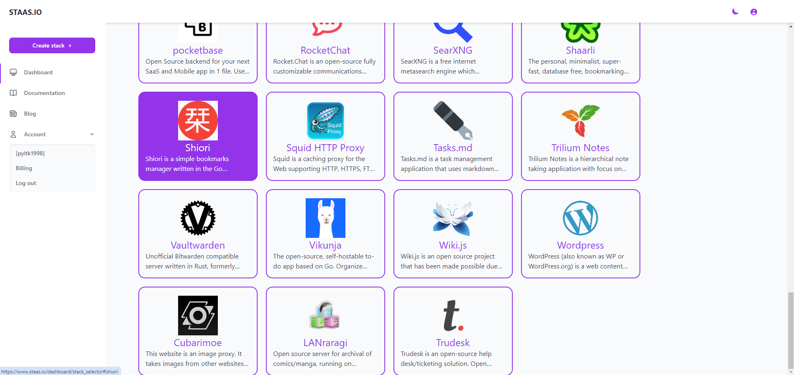
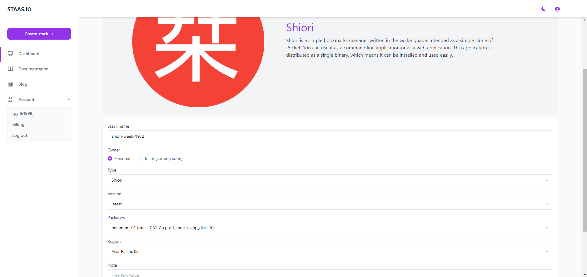
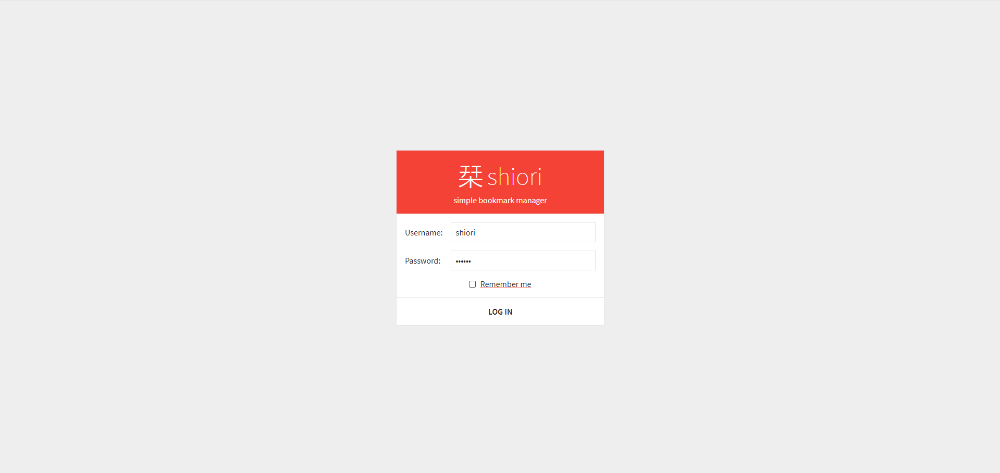

# Introduction
Complete this tutorial to deploy a sample Shiori app via Staas.io without any additional tool/knowledge.

Requirements:
- A verified Staas.io account.

## Creating your first Stack with Staas.io

Shiori is a simple bookmarks manager written in the Go language. Intended as a simple clone of Pocket. You can use it as a command line application or as a web application. This application is distributed as a single binary, which means it can be installed and used easily.

### Instance Creation
Staas.io gives you more controls with the instance you run your app on.

Go to your [Staas.io Dashboard](https://www.staas.io/dashboard?utm_source=docs)

Click on "Create new stack +".
From this screen, you can select your stack of choice including Programming Languages, Databases and Applications. In this tutorial, we'll select **Shiori**.

In the Create Stack page, configure your stack:
- **Stack name**: This is your stack name. It is also the name of your web domain once the stack is created.
- **Owner**: Set it as a private or a shared stack so that your team can contribute and maintain.
- **Type**: This is The stack type. It is the same as the previous page. In this case, Python is already selected.
- **Version**: Select a Python's version. Let's select Python 3.9.9 for our example.
- **Packages**: This is your instance type. Choose your desired hardware's capability. The options are limited to your [Pricing plan](https://www.staas.io/#pricing).
- **Region**: Choose a region to deploy your stack. The app should be deployed closest to your target customers.

Press Create and your stack will be created momentarily. An email will be sent to you once it is created and ready to run.

### Manage your Stack in the Dashboard
Once you created the stack, you will be greeted with a Stack Management screen.

Checking out your new domain by clicking on [Domain](){: .btn .btn-purple .ml-2 } button. It will open up your designated domain in a new tab.

## Successfully deployed your Shiori
The default username: **shiori**
The default password: **gopher**
*(Remember to change your password after the first login to avoid illegal access)*

Congratulations, you have successfully deployed your Shiori app through just a few steps with Staas.io
