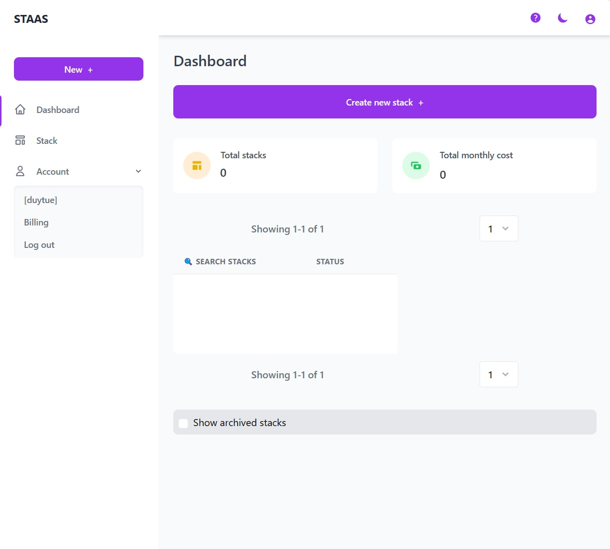
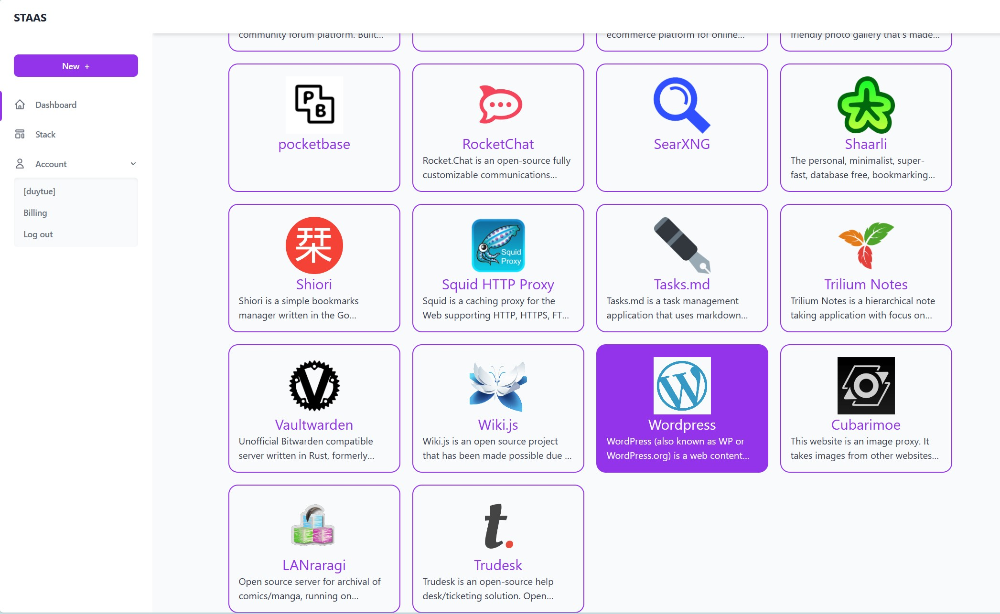
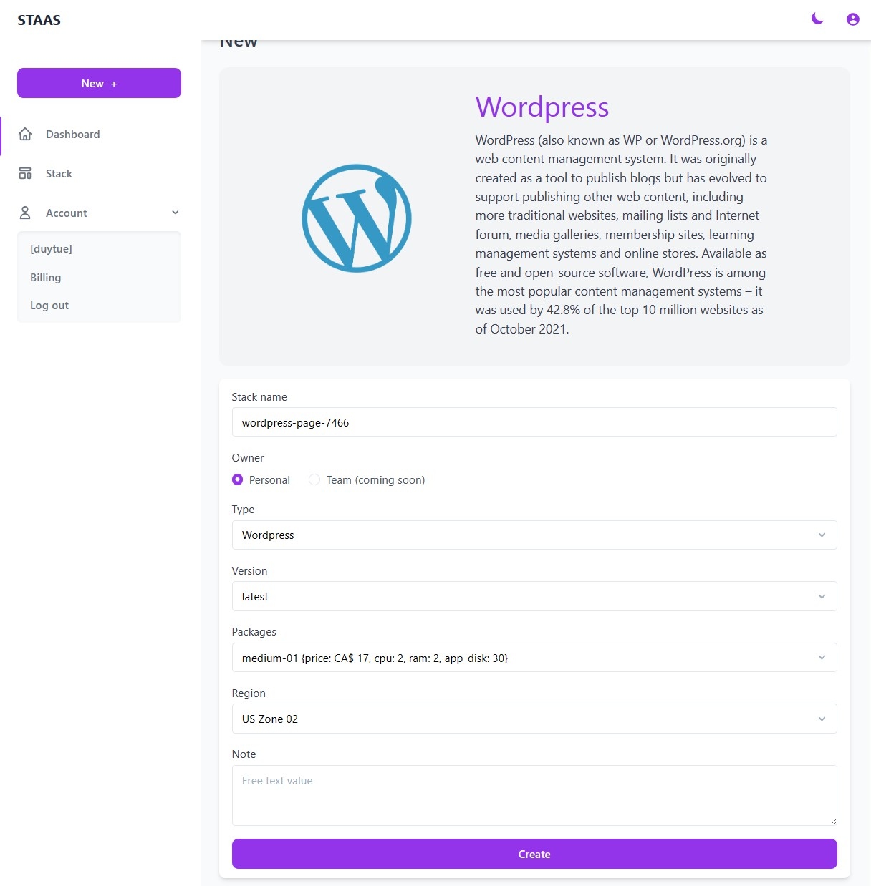
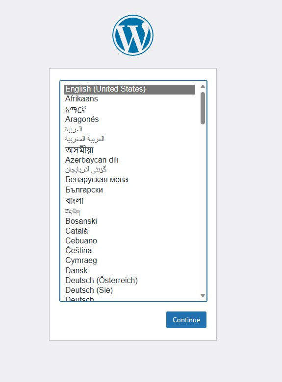
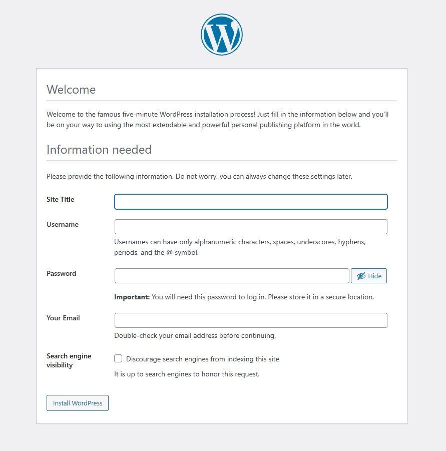

# Introduction
Complete this tutorial to deploy a sample Wordpress app via Staas.io without any additional tool/knowledge.

Requirements:
- A verified Staas.io account.

## Creating your first Stack with Staas.io

WordPress is a web content management system. It was originally created as a tool to publish blogs but has evolved to support publishing other web content, including more traditional websites, mailing lists and Internet forum, media galleries, membership sites, learning management systems and online stores.

### Instance Creation
Staas.io gives you more controls with the instance you run your app on.

Go to your [Staas.io Dashboard](https://www.staas.io/dashboard?utm_source=docs)

Click on "Create new stack +".
From this screen, you can select your stack of choice including Programming Languages, Databases and Applications. In this tutorial, we'll select **WordPress**.

In the Create Stack page, configure your stack:
- **Stack name**: This is your stack name. It is also the name of your web domain once the stack is created.
- **Owner**: Set it as a private or a shared stack so that your team can contribute and maintain.
- **Type**: This is The stack type. It is the same as the previous page. In this case, WordPress is already selected.
- **Version**: Select a WordPress's version. Let's select WordPress latest for our example.
- **Packages**: This is your instance type. Choose your desired hardware's capability. The options are limited to your [Pricing plan](https://www.staas.io/#pricing).
- **Region**: Choose a region to deploy your stack. The app should be deployed closest to your target customers.

Press Create and your stack will be created momentarily. An email will be sent to you once it is created and ready to run.

### Manage your Stack in the Dashboard
Once you created the stack, you will be greeted with a Stack Management screen.

Checking out your new domain by clicking on [Domain](){: .btn .btn-purple .ml-2 } button. It will open up your designated domain in a new tab.

## Set up your WordPress page
You will be greeted with a installation process to setup your WordPress page.

Once you have finished, you will be on your WordPress's Admin Page.

Congratulations, you have successfully deployed your WordPress app through just a few steps with Staas.io
