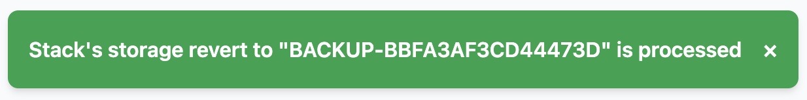

# Backup Storage with Staas.io

Securing and ensuring the recoverability of your application data is of utmost importance.
Staas.io streamlines essential backup and restore processes, offering dependable tools to protect your valuable information and facilitate smooth recovery in unforeseen circumstances.

Our objective is to guarantee minimal or upto zero downtime for your application, achieved through the provision of highly available persistent storage solutions.
Even when you need to relocate your application to another region, your data can be made available for use in just a few minutes.

## Restore a Snapshot
**Your persistent storage** is automatically backed up periodically by Staas.io.
Depends on your package and settings, a snapshot of your storage volume is saved using our Cloud native distributed block storage.

If your stack has a persistent storage, you can view its snapshots in the Control Panel in the Dashboard.

Click on the box to reveal a dropdown with all saved snapshots.

To revert to your previous state, select your desired snapshot and click the [Revert](){: .btn .btn-purple .ml-2 .mr-2 } button to submit request to our system.
A pop-up will indicate that your request is being processed.

In a few minutes, your storage will be reverted to the selected snapshots.

You can also view the logs for this revert action by going to the Action Log section, select the latest `stack-apply` log and press View.
