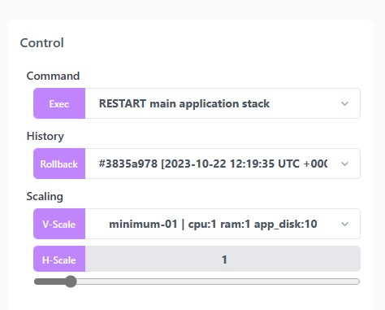
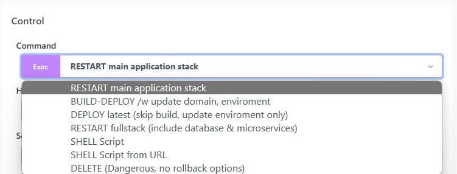

# Control Panel

In your stack's dashboard, you can see a Control section on the right side of the screen.
The control dashboard is a centralized interface designed to efficiently manage various aspects of your stack.
It offers a range of functionalities, making it a robust tool for system administrators and developers.

The **Command** section allows you to perform essential operations like deploying new updates, initiating builds, restarting services, executing shell scripts, and deleting your stack.

The **History** feature provides a historical view of changes made over time, enabling users to revert to previous versions in case of issues.

Additionally, the **Scalling** dashboard facilitates seamless scaling options, supporting both horizontal scaling (adding more instances of applications to distribute load) and vertical scaling (increasing individual resource capacities like CPU or RAM).

This comprehensive suite of functionalities empowers you to efficiently manage your stack, ensuring smooth operations and rapid responses to changing requirements.

---
## Deploy / Build / Restart

In the **Command** dropdown menu, you'll find the following commands:
- RESTART (main application stack)
- BUILD-DEPLOY (w/ update domain, environment)
- DEPLOY (latest, skip build, update environment only)
- RESTART (full stack include database & microservices)
- SHELL (script)
- SHELL (script from URL)
- DELETE (stack)

**Usage**: Select a command from the dropdown. Press [Exec](){: .btn .btn-purple .ml-1 .mr-1 } to execute the selected command. A notification will pop up at the top of your dashboard to indicate your action.

**RESTART (main application stack)**

This option allows you to restart just your application without affecting your overall configuration and other services.

**RESTART (full stack include database & microservices)**

This option allows you to restart the full stack including your appilcation, databases, network and microservices. It basically restart the whole server.

**BUILD-DEPLOY (w/ update domain, environment)**

This option allows you to build from your latest code changes and deploy your application with the latest changes from your environment configuration.

**DEPLOY (latest, skip build, update environment only)**

This option allows you to quickly redeploy your application with the latest changes from your environment configuration without building your code from source.

**SHELL**

The SHELL command allows you to submit and execute shell command directly to the server.

You have two options:

##### Option 1: Direct Shell Commands

- In the SHELL interface, you can directly type commands such as `echo "staas is awesome"` and press the `Exec` button to execute the script..

- Staas.io will execute the command on your instance, and you'll see the output directly in the Log section.

##### Option 2: Shell Script File from a URL

- Create a shell script file containing the commands you want to execute. Host this file on a server, for example, at `https://example.com/myscript.sh`.
- Ensure the script file has the necessary permissions to be executed.
- Access the Control Panel.
- Select SHELL (script from URL) Command.
- Paste the URL of your script in the text input.
- You can add additional arguments to your script if needed.
- Press the `Exec` button to execute the script.

**DELETE**

This command permanently removes your stack or application from your account.

**WARNING: This action is destructive and irreversible!**
{: .text-red-200 }

##### Option 3: Using a dedicated SSH terminal
Please refer to [Shell Access]().

---
## Conclusion
Congratulations! You've successfully learned how to use the commands in the Control Panel.
By understanding these options, you can effectively manage and interact with your applications and services on our platform.
