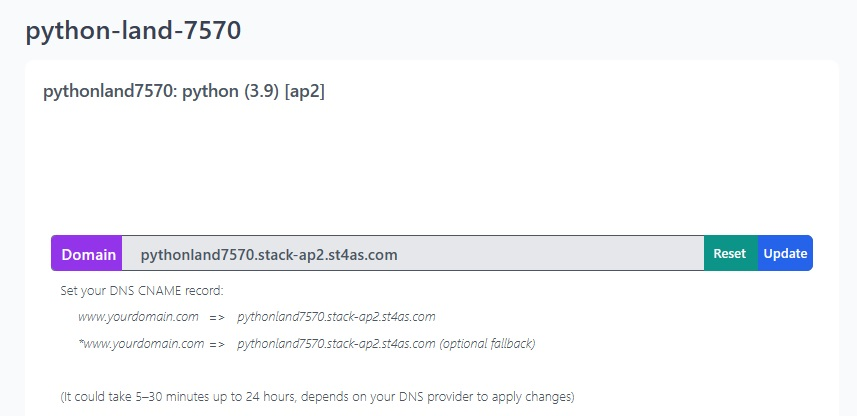

# Use a custom domain

When setting up a Staas.io Stack, it's assigned a `.st4as.com` sub-domain based on your app's name, which is convenient for testing purposes.
However, for a production environment, you'd prefer your application to be accessible through your own domain.

Let's see how you can direct traffic to your site from your desired domain.


## Set a CNAME record

First, let's get your current domain name. You can find your current staas's domain name in your dashboard:


The easiest way to direct traffic to your site is by creating a CNAME record for your custom domain that points to your `.st4as.com` host.
For instance, if your custom domain is `awesome.com` and your app is named `myawesomeapp7520`, you can set up a CNAME record in `awesome.com`'s DNS settings like this:
```
CNAME @ myawesomeapp7520.stack-ap2.st4as.com
```

You’ll need to configure this with your DNS provider.

Now, accessing `awesome.com` will tell the DNS system to look up `myawesomeapp7520.stack-ap2.st4as.com` and return its results.


## HTTPS Certificate
