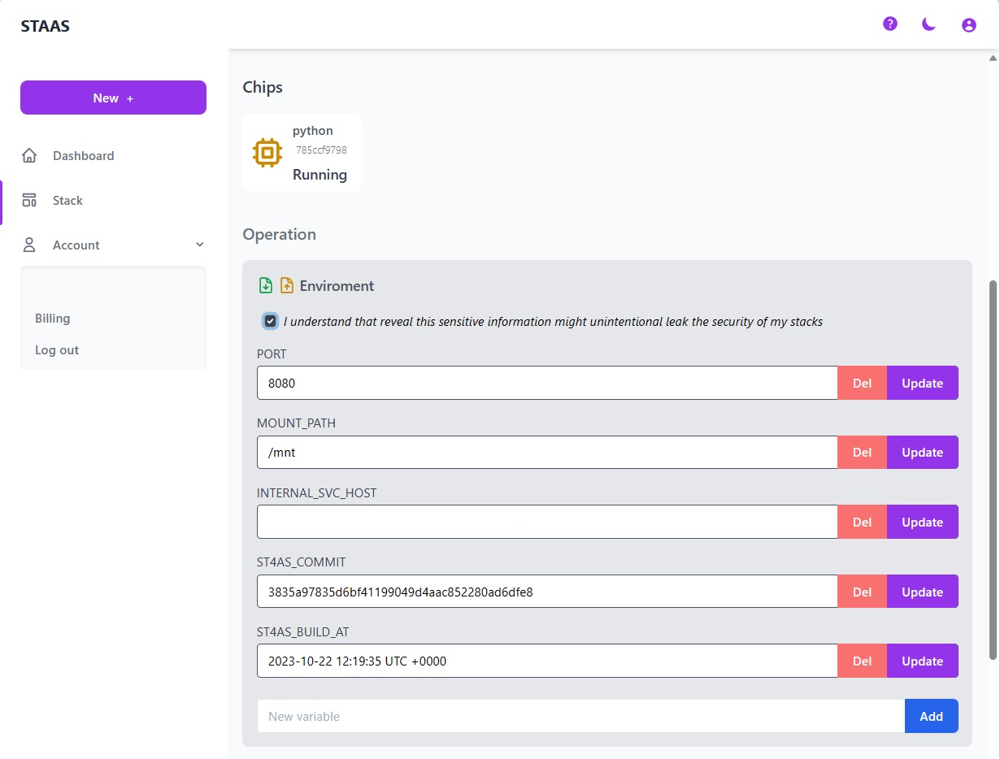
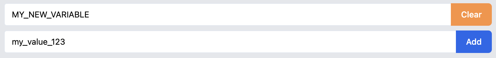
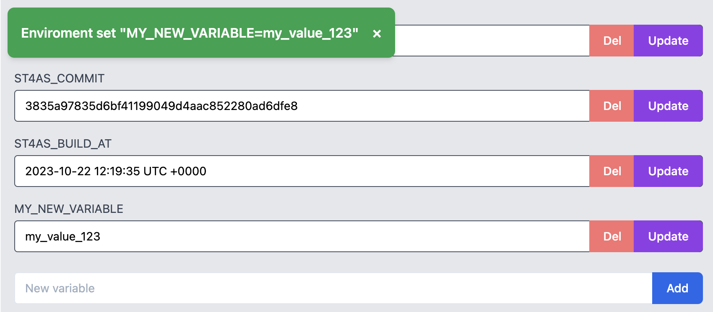

# Enviroment Variables

## What is Environment Variables?
Environment variables are dynamic values external to your application code, influencing its behavior.
They store configuration settings, secrets, and other information crucial for runtime.
These variables are part of the environment in which a process runs and are accessible by the operating system and application during runtime.

Key benefits of environment variables in software development and deployment includes:
- **Configuration Separation**: Keeps configuration separate from code for easy management across different environments.
- **Security Enhancement**: Safely stores sensitive information, preventing hard-coding in the application code.
- **Portability**: Enables the same code to adapt to various environments by adjusting environment variables.
- **Flexibility**: Allows customization without code changes, enhancing adaptability.
- **System Information**: Conveys details about the system, influencing application behavior.

---
# Environment Variables on Staas.io
Given the cloud-based nature of Staas.io, environment variables play a pivotal role in providing you with control over your stack.

- **Build Process**: All environment variables are passed as Build Arguments during the stack-building phase.
- **Application Runtime**: These variables come into play again when your stack is actively running, influencing its behavior and configuration.

## Update Environment Variables
You can update these values in two ways: through Stack Dashboard or Import/Export environment file.

### Edit via Stack Dashboard
This is the easiest and fastest way to review and update your Stack's environment variables.

To access this screen, in your Stack's Dashboard, check the box: **"I understand that reveal this sensitive information might unintentional leak the security of my stacks"** and a list of variables will apear:

<!-- All set variables are shown in this list Most of configured environment variables is -->

Editing a variable is as simple as update the value in the text box and clicking the [Update](){: .btn .btn-purple .ml-2 } or [Del](){: .btn .btn-red .ml-2 } buttons on the right.

To add a new variable, in the final text box:

- Enter the name of your variable in "New Variable": `MY_NEW_VARIABLE`
- Enter the value of `MY_NEW_VARIABLE` in the text box below: `my_value_123`

- Press [Add](){: .btn .btn-blue .ml-2 } to complete adding a new variable.

### Edit via Import/Export

## Update Notes
There are some rules / extra information that you should know about Environment Variables on Staas.io:

- Environment variables on Staas.io could be updated during the Build / Deployment process. However, it is strongly NOT RECOMMENDED to update these values while the build / deploy is in process to avoid any conflict & missing without notice.

- All enviroment variables should be on CAPITALIZED and should not contain any special / nonvisible / non-ASCII character (NewLine, Color Format).

- Although we support complex enviroment value such as single line JSON, but it's not guaranteed to run any special effect due to the vast support of building context of Staas.io.

---
## Common Variables on Staas.io

### Essential Variables

- `PORT`: Indicates your main running application port
- `NODEPORT`: Indicates the main public port for mostly database access*.
- `FILEMANAGER_USERNAME`: User name credential for our built-in File Manager**.
- `FILEMANAGER_PASSWORD`: Password for the built-in File Manager**.
- `FILEMANAGER`: URL address to access the built-in File Manager

* This is only available for Database stacks like MongoDB.
** This is only available for certain Application stacks like Wordpress.

### Read-only Variables
- `INTERNAL_SVC_HOST`: Indicates the private domain for your stack when your need to access it from another stack of the same owner via private network.
- `ST4AS_COMMIT`: Indicates the hash commit of your built image form your Staas' git repository
- `ST4AS_BUILD_AT`: Indicates the build time

### Custom Variables
- `NO_STORAGE`: This variable is used to force remove persistent volume storage to give your stack ability to freely scale & running cross region.
- `COMMAND`: Overwrite the starting command for your stack.
- `K8S_SUB_DIR`: To be added.
