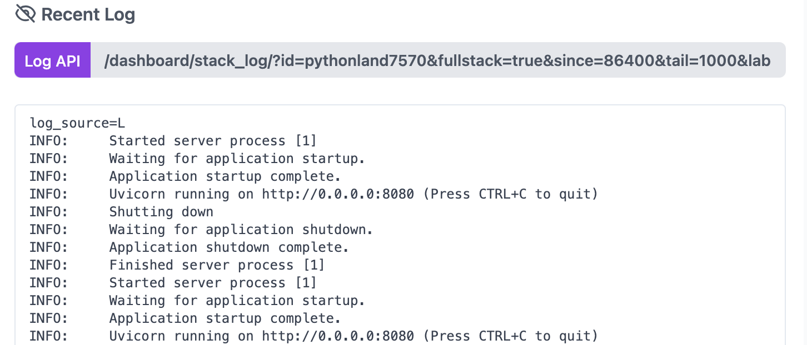
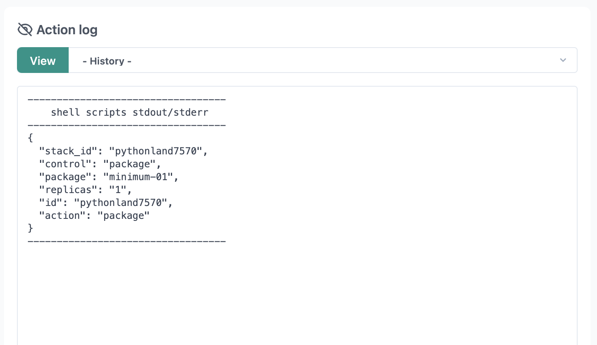
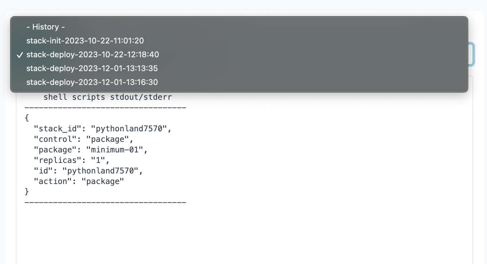

# Logging on Staas.io

Logging is a crucial aspect of managing and monitoring applications, providing insights into their behavior, performance, and potential issues.
Staas.io offers robust logging features to enhance your application management experience.


## Runtime Logs

### Writing to Your Log
Your logs capture anything your stack writes to standard out (stdout) or standard error (stderr).

In Node.js
```js
console.log(`Hello world`);
```

In Ruby:
```ruby
puts "Hello, logs!"
```

In Java:
```java
System.err.println("Hello, logs!");
System.out.println("Hello, logs!");
```

In Python:
```python
print("Hello, logs!")
```

The same holds true for all other supported stack.


### View Logs
You can view your logs through your stack's dashboard.
Staas.io give user access to all containers logs via API.



From your Dashboard, you can already view the log in the windows just below.

Clicking on the [Log API](){: .btn .btn-purple .ml-2 .mr-2 } button will open a new browser tab.


You can edit the URL parameters to filter and format your logs to your liking.
Example URL:
```
https://www.staas.io/dashboard/stack_log/?id=pythonland7570&fullstack=true&since=86400&tail=1000&timestamps=false&format=html&wrap=true&refresh=30
```

#### Parameters:

- **`id`** (string, _required_) 
  - Stack ID: Identifies the stack for which logs are requested.

- **`tail`** (number, _optional_, defaults to 1,000, maximum 1,000,000) 
  - Log Records Limit: Limits the number of log records to retrieve.

- **`since`** (number, _optional_, defaults to 3,600, maxixum `3600x24x7`) 
  - Since Period: Specifies the beginning time from now, in seconds, to retrieve logs.

- **`end`** (number, _optional_) 
  - End Period: Specifies the end time from now, in seconds, to retrieve logs.

- **`timestamps`** (boolean, _optional_, defaults to `true`) 
  - Show/Hide Timestamps: Indicates whether to show or hide timestamps in the log entries.

- **`format`** (string, _optional_, defaults to "`plain`") 
  - Response Format: Specifies the format of the log entries in the response. Available options: "`plain`", "`json`", "`html`"

- **`fullstack`** (boolean, _optional_, defaults to `false`) 
  - Show All Containers Log: Determines whether to show logs for all containers or only the main application container.

- **`reverse`** (boolean, _optional_, defaults to `false`) 
  - Show Logs in Reversed Order: Specifies whether to display logs in reverse order.

- **`label_inst`** (boolean, _optional_, defaults to `true`) 
  - Show/Hide Label for Each Container Instance: Indicates whether to show or hide labels for each container instance.

Feel free to adjust these parameters based on your log retrieval requirements. If you have any questions or need further assistance, refer to the Staas.io documentation or reach out to our support team.


<!-- Parameters:
- `id`: Joi.string().required(), stack id
- `tail`: Joi.number().integer().positive().max(1e6).optional().default(1000), log records limit
- `since`: Joi.number().integer().positive().max(60*60*24*7).optional().default(60*60), since period from now, by second
- `end`: Joi.date().timestamp().optional(), end period from now, by second
- `timestamps`: Joi.boolean().optional().default(true), show/hide timestamps
- `format`: Joi.string().optional().valid('plain', 'json', 'html').default('plain'), response format
- `fullstack`: Joi.boolean().optional().default(false), show all containers log or main app container only
- `reverse`: Joi.boolean().optional().default(false), show logs in reversed order
- `label_inst`: Joi.boolean().optional().default(true), show/hide label for each container instance -->


## Action Logs

Action logs includes Staas's logs such as:
- `Build logs`: Logs generated during the build and deployment phases of your app are distinct from the logs generated during the app's runtime.
- `System logs`: Messages regarding actions performed by the Staas.io platform infrastructure on behalf of your application, such as restarting a crashed process, activating or deactivating a web instance, or displaying an error page in response to an issue within your app.

To view your stack's action logs, in your stack's dashboard, over the Action log area:



Simply select an action / period from the Action log dropdown and press [View](){: .btn .btn-green .ml-2 .mr-2 } button:




An example of action logs:
```
----------------------------------
    shell scripts stdout/stderr
----------------------------------
{
  "stack_id": "pythonland7570",
  "control": "package",
  "package": "minimum-01",
  "replicas": "1",
  "id": "pythonland7570",
  "action": "package"
}
----------------------------------


/stack/config/staas/staas-io/pythonland7570/log/stack-deploy-2023-12-01-13:16:30.log
>>>

BOF
Branch: 'deploy'
commit 3835a97835d6bf41199049d4aac852280ad6dfe8
Author: Tue Tran <email>
Date:   Sun Oct 22 19:07:16 2023 +0700

    init
GITHOOK --> Builder signature: commit a5a3572c7450a1d6838a99cfac2dd09e30e2bd4f
------------------ HANDLE APP ----------------------
CONFIG --> Stack info exist
RESOURCES --> Current resources: DISK_SIZE = 1Gi [1Gi]
Info: VOLUME --> Volume bb32c670--pythonland7570-python exist
BUILD --> Source size: 200K	. 200	. 
BUILD --> Commit: 3835a97835d6bf41199049d4aac852280ad6dfe8
IMAGE_CHECK --> tag: docker.io/registryhub/staas-python:staas-io.pythonland7570.3835a978
IMAGE_BUILD --> Pulling build log in 10s
INFO[0001] Retrieving image manifest python:3.9-alpine  
INFO[0001] Retrieving image python:3.9-alpine from registry index.docker.io 
INFO[0003] Retrieving image manifest python:3.9-alpine  
INFO[0003] Returning cached image manifest              
INFO[0003] Built cross stage deps: map[]                
INFO[0003] Retrieving image manifest python:3.9-alpine  
INFO[0003] Returning cached image manifest              
INFO[0003] Retrieving image manifest python:3.9-alpine  
INFO[0003] Returning cached image manifest              
INFO[0003] Executing 0 build triggers                   
INFO[0003] Building stage 'python:3.9-alpine' [idx: '0', base-idx: '-1'] 
INFO[0006] Using caching version of cmd: RUN pip install --no-cache-dir -r requirements.txt 
INFO[0006] Cmd: EXPOSE                                  
INFO[0006] Adding exposed port: 8080/tcp                
INFO[0006] Cmd: VOLUME                                  
INFO[0006] Adding volume /mnt to ignorelist             
INFO[0006] Creating directory /mnt                      
INFO[0006] Unpacking rootfs as cmd COPY requirements.txt ./ requires it. 
INFO[0008] WORKDIR /usr/src/app                         
INFO[0008] Cmd: workdir                                 
INFO[0008] Changed working directory to /usr/src/app    
INFO[0008] Creating directory /usr/src/app with uid -1 and gid -1 
INFO[0008] Taking snapshot of files...                  
INFO[0008] COPY requirements.txt ./                     
INFO[0008] Taking snapshot of files...                  
INFO[0008] RUN pip install --no-cache-dir -r requirements.txt 
INFO[0008] Found cached layer, extracting to filesystem 
INFO[0011] COPY . .                                     
INFO[0011] Taking snapshot of files...                  
INFO[0011] CMD [ "python", "./main.py" ]                
INFO[0011] No files changed in this command, skipping snapshotting. 
INFO[0011] EXPOSE 8080                                  
INFO[0011] Cmd: EXPOSE                                  
INFO[0011] Adding exposed port: 8080/tcp                
INFO[0011] No files changed in this command, skipping snapshotting. 
INFO[0011] VOLUME ["/mnt"]                              
INFO[0011] Cmd: VOLUME                                  
INFO[0011] Adding volume /mnt to ignorelist             
INFO[0011] Taking snapshot of files...                  
INFO[0011] Pushing image to docker.io/registryhub/staas-python:staas-io.pythonland7570 
INFO[0017] Pushed index.docker.io/registryhub/staas-python@sha256:ec6ddb50d0ad8f857a5f3e79193e1dff871d30a2f420fa08a9d856930756553c 
INFO[0017] Pushing image to docker.io/registryhub/staas-python:staas-io.pythonland7570.3835a978 
INFO[0021] Pushed index.docker.io/registryhub/staas-python@sha256:ec6ddb50d0ad8f857a5f3e79193e1dff871d30a2f420fa08a9d856930756553c 
IMAGE_BUILD --> Size: 
BUILD --> Build image: docker.io/registryhub/staas-python:staas-io.pythonland7570.3835a978
BUILD --> Check available rollback images []
DOMAIN --> Wildcard stack-ap2.st4as.com stack-ap2.st4as.com stack-ap2.st4as.com true
BUILD --> Reconfigure restart strategy
BUILD --> Update environment variables
DEPLOY --> Check yaml done
DEPLOY --> Deploy yaml done

DEPLOY --> Tailing recent deployment logs in 30s
DEPLOY --> Stack status phase: Running


----------------------------------------


2023-12-01T13:17:25.992670405Z INFO:     Started server process [1]
2023-12-01T13:17:25.992726232Z INFO:     Waiting for application startup.
2023-12-01T13:17:25.993374435Z INFO:     Application startup complete.
2023-12-01T13:17:25.993948242Z INFO:     Uvicorn running on http://0.0.0.0:8080 (Press CTRL+C to quit)


----------------------------------------


EOF
```

<!-- Example:
```
https://www.staas.io/dashboard/stack_log/?id=pythonland7570&action_log=true&action_log_url=s3%3A%2F%2Fstack%2Fconfig%2Fstaas%2Fadmin%2Fscratchletter557%2Flog%2Fstack-apply-2023-11-08-04%3A39%3A48.log
```


#### Parameters:

- **`id`** (string, _required_) 
  - Stack ID: Identifies the stack for which action logs are requested.

- **`format`** (string, _optional_, defaults to "`plain`") 
  - Response Format: Specifies the format of the action log entries in the response. Available options: "`plain`", "`json`", "`html`"

- **`action_log`** (boolean, _optional_, defaults to `false`) 
  - Get Action Log Only: Indicates whether to retrieve only the action log.

- **`action_log_url`** (string, URI, _optional_) 
  - ID of Action Log: If this parameter is missing, the last action log is returned. Provides the ID for a specific action log. -->

<!-- Parameters:
- id: Joi.string().required(), stack id
- format: Joi.string().optional().valid('plain', 'json', 'html').default('plain'), response format
- action_log: Joi.boolean().optional().default(false), get action log only
- action_log_url: Joi.string().uri().optional(), id of action log, if this parameter is missing the last action log is returned -->
