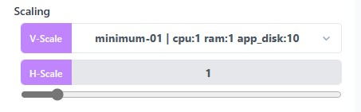

# Scale your Stack

Scaling your stack is essential for ensuring your applications can handle varying workloads and traffic demands.

Staas.io simplifies the scaling process through the Dashboard's Scaling section, offering two powerful options: H-Scale (Horizontal Scaling) and V-Scale (Vertical Scaling).

This document will guide you through these scaling techniques, enabling you to optimize your stack's performance effortlessly.

## Vertical Scaling (V-Scale)

Vertical scaling involves increasing the resources (CPU, RAM, etc.) of your existing instances.

It's ideal for handling applications with increasing resource demands.

### When do you need Vertical Scaling?

**Resource Intensive Tasks**: Choose V-Scale when your application's tasks become more resource-intensive, such as processing large datasets or running complex algorithms. 

Increasing resources like CPU and RAM in existing instances can handle these tasks efficiently.

**Cost-Effectiveness**: Opt for V-Scale when you want to optimize costs.

Instead of adding more instances, vertical scaling allows you to enhance the capabilities of existing instances, saving you money on additional server instances.

### How to Scale your Stack vertically with Staas.io

- Go to the Scaling section in the Control Panel.
- Select V-Scale dropdown.
- Choose the appropriate resource package (CPU, RAM, etc.) for your instances as per your requirements.
- Confirm your selection by clicking the [V-Scale](){: .btn .btn-purple .ml-1 .mr-1 } button.

Staas.io will apply the specified changes, enhancing your existing instances' capabilities to handle resource-intensive tasks.

---
## Horizontal Scaling (H-Scale)

Horizontal scaling involves adding more instances of your application to distribute the workload.

It enhances your stack's capacity to handle increased traffic without overburdening a single server.

### When do you need Horizontal Scaling?

**High Traffic Peaks**: Choose H-Scale when your application experiences sudden spikes in traffic.

By adding more instances, you can distribute the load and maintain optimal performance during peak times.

**Redundancy and Reliability**: Opt for H-Scale to enhance redundancy.

Multiple instances ensure that if one server fails, traffic is automatically redirected to other instances, minimizing downtime.

### How to Scale your Stack horizontally with Staas.io

- Go to the Scaling section in the Control Panel.
- Select H-Scale dropdown.
- Specify the number of additional instances you want to add to your stack by adjusting the slider.
- Confirm your selection by clicking the [H-Scale](){: .btn .btn-purple .ml-1 .mr-1 } button.

Staas.io will automatically distribute incoming traffic across the new instances, enhancing your application's performance and reliability.

---
# Conclusion

Staas.io's Scaling section provides you with the flexibility to adapt to changing workloads efficiently.

Whether you choose Horizontal Scaling for distributing traffic or Vertical Scaling for optimizing resources, Staas.io empowers you to scale your stack seamlessly.

By following the guidelines in this document and staying proactive about monitoring and adjustments, you can ensure your applications perform reliably, even under varying and demanding conditions.
