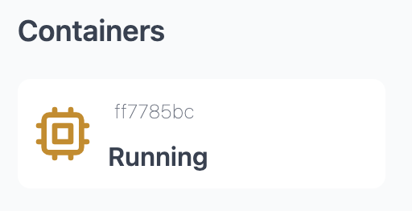
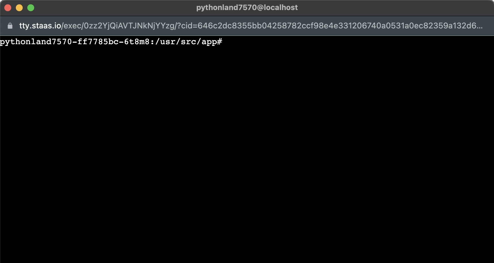

# Shell Access to Running Instance

You can access the shell instance via Web Terminal by clicking in the Chip logo in your stack dashboard:

A terminal will appear within a new browser windows.
You can perform all shell commands within this terminal.

## Notes

1. Because of security purposes, each shell session will automatically end after 30 minutes.

2. Some minor stack/container would not support shell access (such as "Scratch" due to the minimum system requirement of its docker context, without any Shell program), but most of them are, as of they're based on Alpine Linux.

